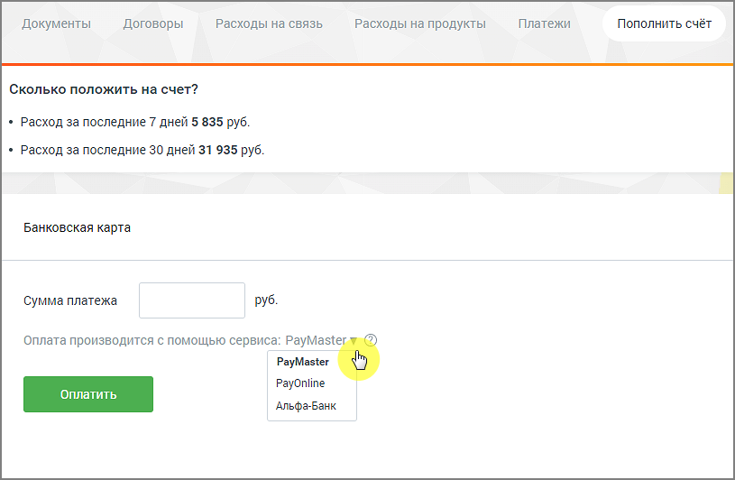

# 6.5.2. Банковские карты

> Трассировка: PDF §6.5.2 · сквозные стр. 96-98 · источники: ч.1 `kb/mango-product-docs/sources/speech-analytics/RECHEVAYA-ANALITIKA_c-KATS_v.1.26.18.pdf` с.96-98.

Пополнение счета с помощью банковских карт возможно через системы: • Paymaster; • PayOnline; • Альфа-Банк. Речевая аналитика & КАТС | v.1.26.18 96

| 8 800 555 55 22, mango-office.ru |  |
| --- | --- |
|  | mango@mangotele.com |

Введите цифрами сумму платежа в одноименное поле. Выберите сервис, при помощи которого будет произведена оплата. Нажмите Оплатить. В результате будет открыта новая вкладка браузера на странице выбранного сервиса. Речевая аналитика & КАТС | v.1.26.18 97

| 8 800 555 55 22, mango-office.ru |  |
| --- | --- |
|  | mango@mangotele.com |
