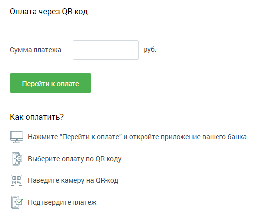

# 6.5.3. Оплата через QR-код

> Трассировка: PDF §6.5.3 · сквозные стр. 98 · источники: ч.1 `kb/mango-product-docs/sources/speech-analytics/RECHEVAYA-ANALITIKA_c-KATS_v.1.26.18.pdf` с.98.

Пополнение счета через QR-код производится с помощью сервиса PayMaster, без взимания комиссии. Введите цифрами сумму платежа в одноименное поле. Нажмите кнопку «Перейти к оплате». В результате в новой вкладке браузера откроется страница с QR-кодом. Откройте на смартфоне мобильное приложение вашего банка. Далее действуйте по приведенной на скриншоте инструкции.
