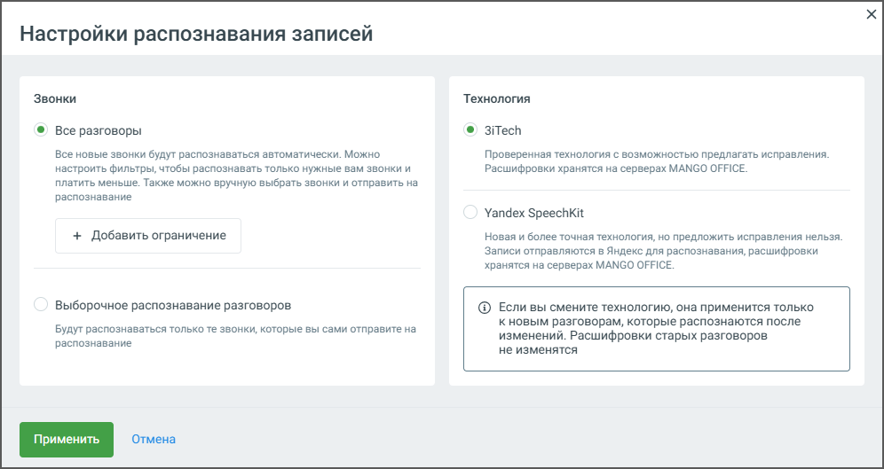

# 7.1.1. Распознавание разговоров

> Трассировка: PDF §7.1.1 · сквозные стр. 104-105 · источники: ч.1 `kb/mango-product-docs/sources/speech-analytics/RECHEVAYA-ANALITIKA_c-KATS_v.1.26.18.pdf` с.104-105.

Блок Настройка распознавания позволяет настроить функции распознавания и пересылки аудиозаписей разговоров сотрудников. По нажатию на кнопку Настройки открывается окно настроек распознавания записей:

1. Режим распознавания: • Все разговоры – в этом режиме будут распознаваться все новые разговоры и записи, автоматически отправляемые на распознавание со страницы "Записи разговоров". • Выборочное распознавание разговоров – распознаются только те записи, которые вручную отправлены пользователем со страницы "Записи разговоров". 2. Управление сотрудниками – Распознавать/Исключить: • Возможность выбрать сотрудников, чьи разговоры должны распознаваться или исключаться из распознавания. 3. Лимит распознавания в день: • Вводимое значение ограничивает количество минут разговоров, которые могут быть распознаны за один день. Пользователь может задать минимальное количество для обработки (в примере на скриншоте выбрано 213 минут). 4. Направление звонков для распознавания: Пользователь может выбрать направление звонков, которые будут распознаваться: • Входящие • Исходящие Речевая аналитика & КАТС | v.1.26.18 104

| 8 800 555 55 22, mango-office.ru |  |
| --- | --- |
|  | mango@mangotele.com |

• Внутренние 5. Расписание распознавания (если соответствующая услуга подключена): • Пользователь может настроить время работы системы распознавания по дням недели. Клик по кнопке Задать расписание откроет окно настройки расписания. Зеленым цветом отмечено время, когда разговоры будут отправляться на распознавание. В соответствии с настроенным расписанием под распознавание будут попадать все (с учетом других настроек распознавания) записанные разговоры, время начала которых лежит в заданном интервале. Часовой пояс – Москва. • При необходимости можно обновить расписание через кнопку Обновить. 6. Выбор технологии распознавания – предлагается две технологии на выбор: • 3iTech – проверенная технология с возможностью предлагать исправления, хранение расшифровок на серверах Mango Office. При выборе 3iTech пользователю доступны 700 приветственных минут для распознавания звонков. • Yandex SpeechKit – более точная технология, но без возможности внесения исправлений. Отправка записей в Яндекс для распознавания с последующим хранением расшифровок на серверах Mango Office. После настройки всех параметров необходимо нажать кнопку Применить для сохранения изменений. Если внесенные изменения не требуются, можно выбрать Отмена, чтобы вернуться к предыдущим настройкам. Эти настройки дают гибкость в управлении процессом распознавания аудиозаписей, позволяют ограничить количество обрабатываемых записей, а также задать удобное расписание для работы системы. внимание Для подключения отсутствующих услуг необходимо обращаться к Персональному менеджеру.
