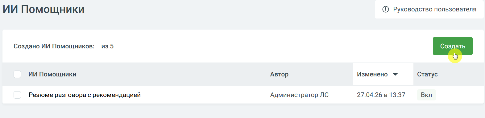

# 7.1.4.2. Как создать ИИ Помощника

> Трассировка: PDF §7.1.4.2 · сквозные стр. 109-110 · источники: ч.1 `kb/mango-product-docs/sources/speech-analytics/RECHEVAYA-ANALITIKA_c-KATS_v.1.26.18.pdf` с.109-110.

1. Перейдите в раздел ИИ Помощники 2. Нажмите кнопку Создать

3. Откроется форма создания нового ИИ Помощника Речевая аналитика & КАТС | v.1.26.18 109

| 8 800 555 55 22, mango-office.ru |  |
| --- | --- |
|  | mango@mangotele.com |

