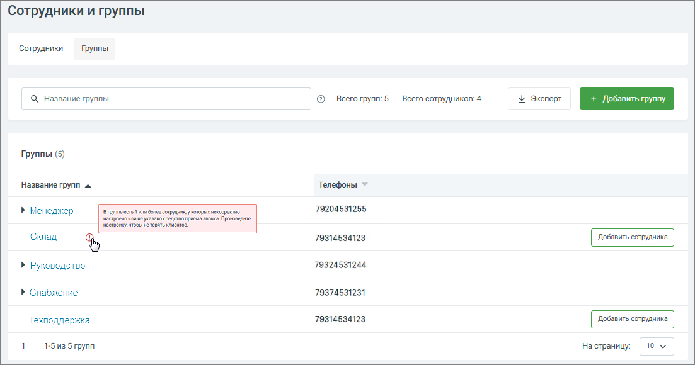

# 7.2.2. Вкладка «Группы»

> Трассировка: PDF §7.2.2 · сквозные стр. 120-121 · источники: ч.1 `kb/mango-product-docs/sources/speech-analytics/RECHEVAYA-ANALITIKA_c-KATS_v.1.26.18.pdf` с.120-121.

Для создания группы сотрудников, нажмите кнопку «Добавить группу».

На вкладке доступна следующая информация: • Просмотр списка групп – отображает все созданные группы сотрудников с указанием количества групп и общего числа сотрудников. • Поиск групп – позволяет быстро находить группу по её названию. • Экспорт – выгружает список групп в файл для резервного копирования или дальнейшей обработки. • Просмотр телефонов группы – показывает номер или список номеров, закреплённых за группой. • Открытие состава группы – при клике на название группы раскрывается список сотрудников, входящих в неё. • Добавление сотрудника в группу – позволяет напрямую добавить сотрудника в выбранную группу через кнопку «Добавить сотрудника». • Просмотр предупреждений по группе – отображает индикаторы ошибок (например, отсутствует номер), чтобы пользователь мог оперативно исправить настройки группы. • Добавление группы – открывает форму создания новой группы с возможностью задать её название и параметры. Далее заполните параметры группы (наименование группы) и добавьте в группу сотрудников. Речевая аналитика & КАТС | v.1.26.18 120

| 8 800 555 55 22, mango-office.ru |  |
| --- | --- |
|  | mango@mangotele.com |

