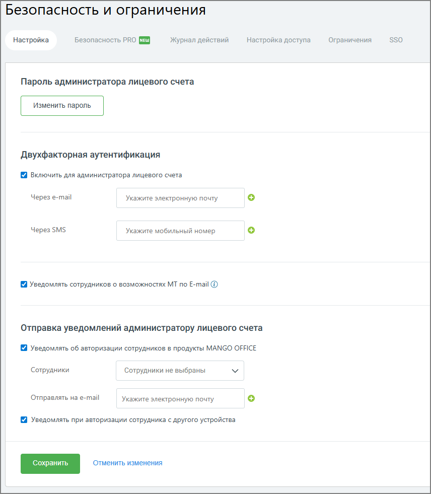

# 7.3.1. Вкладка «Настройки»

> Трассировка: PDF §7.3.1 · сквозные стр. 122-124 · источники: ч.1 `kb/mango-product-docs/sources/speech-analytics/RECHEVAYA-ANALITIKA_c-KATS_v.1.26.18.pdf` с.122-124.

Пароль администратора ЛС Для изменения пароля администратора нажмите на кнопку Изменить пароль. Подтвердите отправку письма на зарегистрированный E-mail. На указанный E-mail отправляется письмо с уникальной одноразовой ссылкой для восстановления пароля и инструкцией. Речевая аналитика & КАТС | v.1.26.18 122

| 8 800 555 55 22, mango-office.ru |  |
| --- | --- |
|  | mango@mangotele.com |

Ссылка действительна в течение 24 часов. Пароль по ссылке можно поменять только один раз. При щелчке по ссылке в браузере будет открыта страница с формой установки нового пароля.

Укажите новый пароль, соблюдая указанные критерии надежности. После заполнения полей нажмите Сохранить. После инициации смены пароля администратором лицевого счета при первом входе в Личный кабинет отображается форма ввода двухфакторной аутентификации. Код верификации формируется и отправляется на e-mail, указанный при регистрации Лицевого счета. Важные замечания: Смена пароля: Пользователь может сменить свой текущий пароль самостоятельно, вводя текущий пароль для подтверждения. Никто, кроме пользователя, не может сменить его пароль. Доступность функции: Возможность сброса паролей доступна только клиентам с соответствующей услугой. Двухфакторная аутентификация • Чекбокс «Включить для администратора лицевого счета». Если чекбокс отмечен для администратора лицевого счета включена двухфакторная аутентификация. Метод получения кода аутентификации: o Через e-mail: на указанную электронную почту администратора лицевого счета, одну или несколько. o Через SMS: на указанный мобильный номер администратора лицевого счета, один или несколько. • Чекбокс «Включить для всех сотрудников». Если чекбокс отмечен двухфакторная аутентификация включена для всех сотрудников. Метод получения кода аутентификации: o Через e-mail: выберите этот вариант, если хотите, чтобы коды аутентификации отправлялись на электронную почту сотрудников, указанные в карточке сотрудника. o Через SMS: выберите этот вариант, если хотите, чтобы коды аутентификации отправлялись через SMS, но номер мобильного телефона, указанного в карточке сотрудника. o Через e-mail и SMS: коды отправляются и на электронную почту, и через SMS. При выборе метода получения кода следует учесть, что отправка SMS является платной услугой и зависит от номера региона получателя. Речевая аналитика & КАТС | v.1.26.18 123

| 8 800 555 55 22, mango-office.ru |  |
| --- | --- |
|  | mango@mangotele.com |

Для сотрудников двухфакторная аутентификация и другие параметры безопасности настраиваются на вкладке Безопасность PRO. Уведомления о возможностях МТ При установленном флаге на E-mail сотрудника, указанный в его карточке, будет отправлено сообщение, содержащее ссылку на установление софтфона MANGO Talker. Отправка сообщения на указанный адрес выполняется каждый раз после того, как администратор либо другой пользователь с соответствующей ролью заполнил пустое поле E-mail в карточке сотрудника и нажал кнопку Сохранить. Уведомления помогают сотрудникам быстрее ознакомиться с функциональностью и начать работу без дополнительного обучения или обращений к администратору. Уведомления администратору лицевого счёта Блок используется для настройки уведомлений администратору о действиях сотрудников в продуктах MANGO OFFICE. Доступны следующие параметры: • получение уведомлений об авторизации сотрудников; • выбор сотрудников, по которым необходимо получать уведомления; • указание адреса электронной почты для получения уведомлений; • получение уведомлений при входе сотрудника с нового устройства. Уведомления позволяют администратору контролировать активность пользователей и оперативно реагировать на подозрительные или нестандартные действия.
