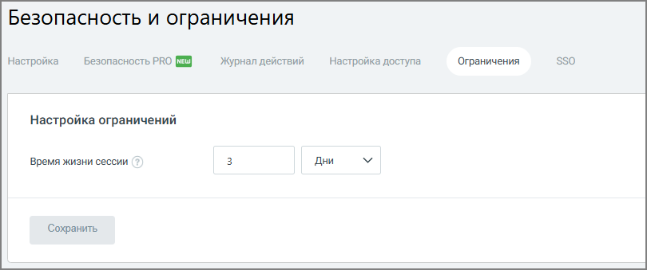

# 7.3.5. Вкладка «Ограничения»

> Трассировка: PDF §7.3.5 · сквозные стр. 129 · источники: ч.1 `kb/mango-product-docs/sources/speech-analytics/RECHEVAYA-ANALITIKA_c-KATS_v.1.26.18.pdf` с.129.

Вкладка Ограничения предназначена для управления параметрами времени жизни пользовательской сессии в Личном кабинете ВАТС. Настройка позволяет задать период, по истечении которого пользователю потребуется повторная авторизация в системе. Время жизни сессии может быть настроено с минимальным интервалом в 5 минут и максимальным в 365 дней.

После истечения заданного времени с момента последней авторизации пользователь будет автоматически выведен из системы и должен будет войти повторно.
