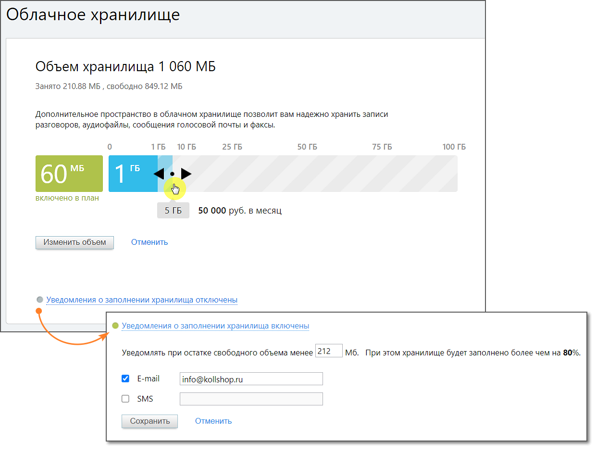

# 7.4. Облачное хранилище

> Трассировка: PDF §7.4 · сквозные стр. 130-131 · источники: ч.1 `kb/mango-product-docs/sources/speech-analytics/RECHEVAYA-ANALITIKA_c-KATS_v.1.26.18.pdf` с.130-131.

Речевая аналитика & КАТС | v.1.26.18 130

| 8 800 555 55 22, mango-office.ru |  |
| --- | --- |
|  | mango@mangotele.com |

В разделе задаются настройки хранения данных в защищенном персональном облачном хранилище.

Пользователь может настроить хранение записей и текстов распознанных разговоров в защищенном персональном облачном хранилище, что позволяет не беспокоиться об их сохранности. Бесплатно предоставляемый объем хранилища отображается на шкале зеленым цветом (см. рисунок выше), дополнительно оплаченный – голубым. Для изменения доступного пространства облачного хранилища переместите ползунок в нужное положение. При перетаскивании ползунка под ним отображаются текущий выбранный объем и стоимость ежемесячной абонентской платы за пользование хранилищем. Подтвердите операцию, нажав на кнопку Изменить объем. Для того, чтобы оперативно узнать о достижении критического объема облачного хранилища, нажмите на ссылку «Уведомления о заполнении хранилища включены» и включите отправку SMS-уведомлений установив соответствующий флаг. Отправка уведомлений на электронную почту включена по умолчанию. В случае, когда остаток свободного объема достигнет указанного критического значения и/или остаток составит 5 Мб, на заданный телефонный номер и/или электронный почтовый ящик будет автоматически отправлено соответствующее сообщение.
