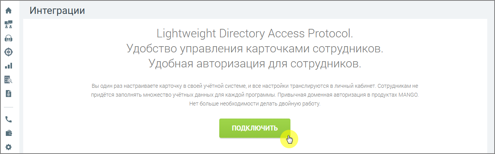

# 7.5. Подключение по LDAP

> Трассировка: PDF §7.5 · сквозные стр. 131-132 · источники: ч.1 `kb/mango-product-docs/sources/speech-analytics/RECHEVAYA-ANALITIKA_c-KATS_v.1.26.18.pdf` с.131-132.

Данный инструмент предназначен для интеграции со сторонними сервисами по протоколу Lightweight Directory Access Protocol (LDAP) с целью синхронизации данных о сотрудниках. Речевая аналитика & КАТС | v.1.26.18 131

| 8 800 555 55 22, mango-office.ru |  |
| --- | --- |
|  | mango@mangotele.com |

Настройка подключения по LDAP будет доступна только после подключения услуги. Для этого нажмите Подключить, ознакомьтесь с условиями подключения и нажмите Подтвердить.

После подключения услуги необходимо произвести настройку функционала. Настройка осуществляется при помощи мастера настройки, определяющего порядок внесения информации. Порядок внесения информации. Настройка интеграции распределена на четыре шага: 1. Подключение к LDAP-серверу – ввод данных для подключения к сервису; 2. Сопоставление атрибутов – сопоставление информации между полями карточек; 3. Сопоставление сотрудников – поиск и сопоставление карточек сотрудников двух систем; 4. Настройка синхронизации – настройка синхронизации и расписания. Каждый последующий шаг доступен только при корректном выполнении предыдущего. По завершении настроек активируется кнопка Выполнить синхронизацию.
