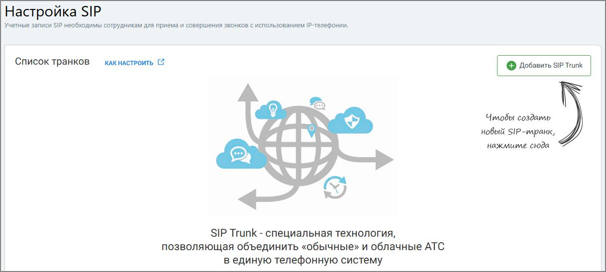

# 7.6. Настройка SIP

> Трассировка: PDF §7.6 · сквозные стр. 140-141 · источники: ч.1 `kb/mango-product-docs/sources/speech-analytics/RECHEVAYA-ANALITIKA_c-KATS_v.1.26.18.pdf` с.140-141.

На вкладке Настройка SIP нажмите на кнопку Добавить SIP Trunk

В открывшемся окне произведите необходимые настройки вкладок. Речевая аналитика & КАТС | v.1.26.18 140

| 8 800 555 55 22, mango-office.ru |  |
| --- | --- |
|  | mango@mangotele.com |
