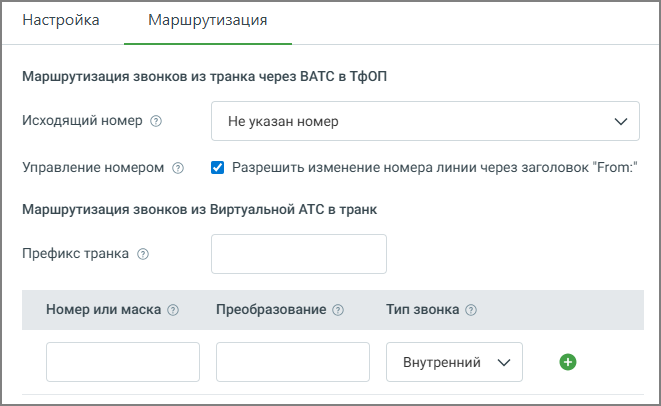

# 7.6.2. Вкладка Маршрутизация

> Трассировка: PDF §7.6.2 · сквозные стр. 143-144 · источники: ч.1 `kb/mango-product-docs/sources/speech-analytics/RECHEVAYA-ANALITIKA_c-KATS_v.1.26.18.pdf` с.143-144.

На вкладке пользователь настраивает маршрутизацию вызовов для SIP Trunk - то есть определяет, как именно должны проходить звонки между Виртуальной АТС и внешней телефонией.

Исходящий номер – определяет, какой номер будет отображаться у абонента, если звонок выходит во внешнюю сеть через транк. Если номер не указан, используется номер, настроенный у оператора или по умолчанию. Разрешить изменение номера линии через заголовок "From" – разрешает использовать в качестве АОН номер, переданный вашей Виртуальной АТС в поле From SIP-пакета. Если АОН не удаётся получить, система подставит номер, указанный в поле «Исходящий номер». Префикс транка – задаёт код, который пользователь набирает перед номером, чтобы направить звонок через этот транк. Номер или маска – определяет конкретный номер или диапазон номеров, для которых применяется правило маршрутизации. Преобразование – задаёт изменение номера перед отправкой в транк (например, добавление или удаление префикса). Тип звонка – определяет, к каким вызовам применяется правило: внутренним, внешним или всем. Кнопка «+» – добавляет новое правило маршрутизации в таблицу. Речевая аналитика & КАТС | v.1.26.18 143

| 8 800 555 55 22, mango-office.ru |  |
| --- | --- |
|  | mango@mangotele.com |
