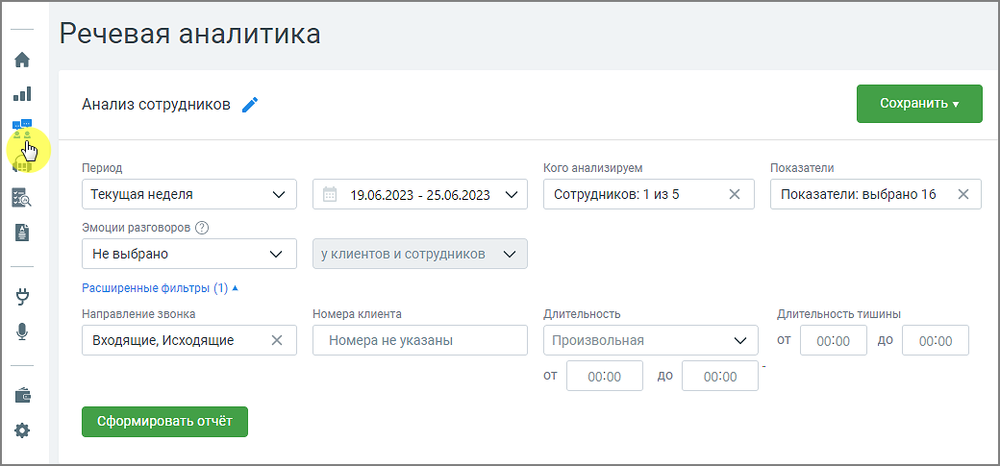

# 2.2.1. Блок фильтров

> Трассировка: PDF §2.2.1 · сквозные стр. 9-11 · источники: ч.1 `kb/mango-product-docs/sources/speech-analytics/RECHEVAYA-ANALITIKA_Skoring_Rukovodstvo-polzovatelya_v.1.26.15.pdf` с.9-11.

Кнопка Сохранить – сохранение отчета на странице «Мои отчеты» с выбором вида графика на странице мои отчеты Пиктограмма «карандаш» – переименование отчета Речевая аналитика. Скоринг | v.1.26.15 9

| 8 800 555 55 22, mango-office.ru |  |
| --- | --- |
|  | mango@mangotele.com |

При формировании отчета пользователям доступна фильтрация: Период – произвольный, текущий день, текущая неделя, текущий месяц, с прошлого месяца, с позапрошлого месяца, текущий год, весь период; Кого анализируем – список всех сотрудников, сгруппированный по группам. Если ни один сотрудник не выбран, отчет формируется по всем сотрудникам; Показатели – все тематики (в том числе неактивные), а также характеристики разговора. Подробнее здесь. Эмоции разговоров – дополнительная настройка для фильтрации разговоров в зависимости от выбранной эмоции: негативно, позитивно, нейтрально. В таблице отчета отображаются соответствующими пиктограммами-смайликами. Эмоции определяются на основании звуков (тембра, громкости). У клиента и сотрудников – у кого анализировать эмоции разговора. Этот фильтр выбран всегда. Расширенные фильтры: Направление звонка – входящий, исходящий, внутренний; Номер клиента – выбор произвольного номера клиента; Длительность – длительность разговора, по умолчанию установлена произвольная длительность разговора.

Длительность тишины – используя этот фильтр руководитель может контролировать сотрудников на предмет тишины в разговорах, для выявления слабых мест в работе операторов. Фильтр применим только к новым записям. Речевая аналитика. Скоринг | v.1.26.15 10

| 8 800 555 55 22, mango-office.ru |  |
| --- | --- |
|  | mango@mangotele.com |

| • Если не выбрана величина "от" – отфильтруются все разговоры, где длительность тишины |
| --- |
| была до указанного времени. |
| • Если не выбрала величина "до" – отфильтруются разговоры, где длительность тишины была |
| более указанного времени. |

Длительность тишины также отображается на плеере расшифровки разговора.

Внутри фильтра действует принцип фильтрации – ИЛИ (когда одно из условий истинно – когда в записях разговоров срабатывает одно из условий). Между фильтрами действует принцип фильтрации – И (когда все условия истинны – когда в записях разговоров присутствуют все условия). Изменение какого-либо из дополнительных фильтров не приводит к автоматическому обновлению данных в отчете. Для обновления данных нажмите кнопку «Сформировать отчет».
