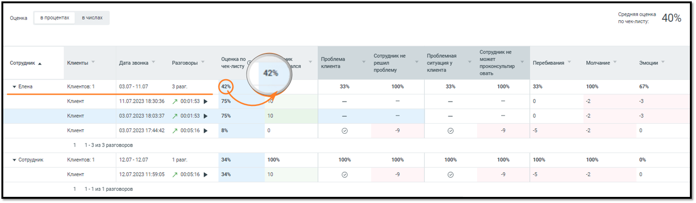
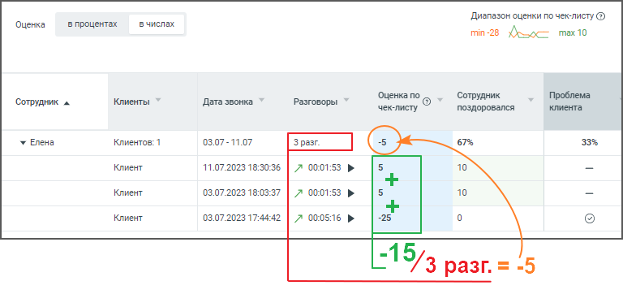
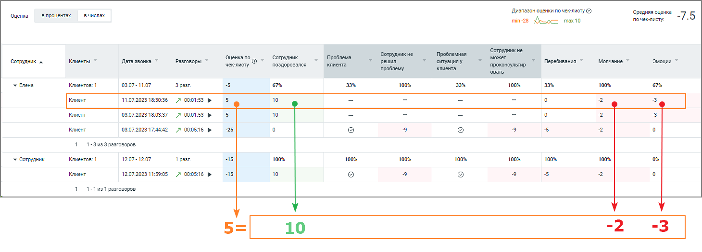
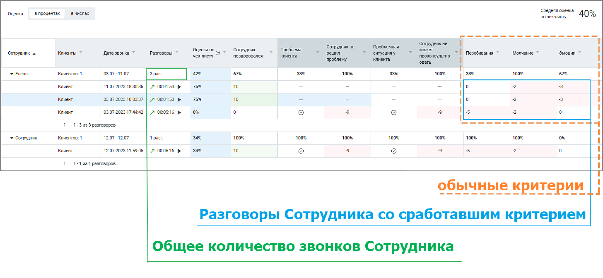
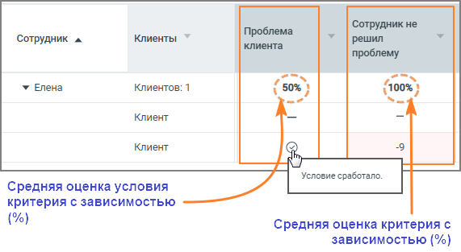

# 2.5.3. Правила подсчета статистики

> Трассировка: PDF §2.5.3 · сквозные стр. 31-37 · источники: ч.1 `kb/mango-product-docs/sources/speech-analytics/RECHEVAYA-ANALITIKA_Skoring_Rukovodstvo-polzovatelya_v.1.26.15.pdf` с.31-37.

Рассмотрим правила подсчета статистики на примере скриншотов ниже (в числах и процентах): Речевая аналитика. Скоринг | v.1.26.15 31

| 8 800 555 55 22, mango-office.ru |  |
| --- | --- |
|  | mango@mangotele.com |

Рис. 1. Пример в числах

Рис. 2. Пример в процентах

Рис. 3. Критерии чек-листа 1) Подсчет средней оценки по чек-листу в процентах, производится по формуле: (P + |S |) / (|S | + S ) отриц отриц полож

| Где: |
| --- |
| • Р=P +P +…P – сумма баллов критериев, которые сработали во всех N разговорах; 1 2 N |

Речевая аналитика. Скоринг | v.1.26.15 32

| 8 800 555 55 22, mango-office.ru |  |
| --- | --- |
|  | mango@mangotele.com |

| • S = S +S +…+S – общая возможная сумма баллов отрицательных критериев отриц отриц1 отриц2 отрицN |
| --- |
| для всех N разговоров. Если условие сложного критерия в отдельном разговоре не |
| сработало, то этот разговор не учитывается в общей сумме баллов; |

| На примере рис.3 выше S составляет либо -28 либо -10 баллов, в зависимости от отриц |
| --- |
| выполнения условия критерия в разговоре. |

| • S = S +S +…+S – общая возможная сумма баллов положительных полож полож1 полож2 положN |
| --- |
| критериев для всех N разговоров. Если условие сложного критерия в отдельном разговоре |
| не сработало, то этот разговор не учитывается в общей сумме баллов; |

На примере рис.3 выше S равно 10 баллам. полож

| Таким образом для примера рис.2 выше средняя оценка по чек-листу в процентах рассчитывается |
| --- |
| следующим образом: |
| Всего состоялось 4 разговора. Для первого и второго разговора условие сложного критерия в |
| отдельном разговоре не сработало. Значит эти разговоры не учитываются в общей сумме баллов |
| и для этих разговоров S = -10, а S 10. отриц полож = |
| Для третьего и четвертого разговора условие сложного критерия в отдельном разговоре сработало. |
| Значит эти разговоры учитываются в общей сумме баллов и для этих разговоров S = -28, а отриц |
| S 10. полож = |
| Считаем итоговую среднюю оценку по чек-листу в процентах: |
| ((10-2-3)+(10-2-3)+(0-9-9-5-2)+(10-9-9-5-2)+(\|-10\|+\|-10\|+\|-28\|+\|-28\|)) / ((\|-10\|+10)+(\|-10\|+10)+(\|-28\|+10) |
| +(\|-28\|+10)) = 0.396 |
| Итого 40%. |
|  |
| 2) Подсчет средней оценки по чек-листу в числах, производится по формуле: |

P/С Где:

| • Р – сумма баллов критериев, которые сработали во всех разговорах; |
| --- |
| • С – количество всех разговоров. |

Речевая аналитика. Скоринг | v.1.26.15 33

| 8 800 555 55 22, mango-office.ru |  |
| --- | --- |
|  | mango@mangotele.com |

|  |
| --- |
| 3) Подсчет общей оценки (в процентах) отдельного сотрудника для табличной части статистики, |
| производится аналогично п.1. При этом рассматриваются разговоры только этого сотрудника. |
| Таким образом для примера рис.2 выше средняя оценка по чек-листу в процентах для сотрудника |
| «Елена» рассчитывается следующим образом: |
| Всего состоялось 3 разговора. Для первого и второго разговора условие сложного критерия в |
| отдельном разговоре не сработало. Значит эти разговоры не учитываются в общей сумме баллов |
| и для этих разговоров S = -10, а S 10. отриц полож = |
| Для третьего разговора условие сложного критерия в отдельном разговоре сработало. Таким |
| образом этот разговор учитывается в общей сумме баллов и для этого разговора S = -28, а отриц |
| S 10. полож = |
| Считаем итоговую среднюю оценку по чек-листу для сотрудника «Елена» в процентах: |
| ((10-2-3)+(10-2-3)+(0-9-9-5-2)+(\|-10\|+\|-10\|+\|-28\|)) / ((\|-10\|+10)+(\|-10\|+10)+(\|-28\|+10)) = 0.42 |
| Итого 42% |

Речевая аналитика. Скоринг | v.1.26.15 34

| 8 800 555 55 22, mango-office.ru |  |
| --- | --- |
|  | mango@mangotele.com |

| 4) Подсчет общей оценки по чек-листу (в числах) отдельного сотрудника для табличной части |
| --- |
| статистики, производится аналогично п.2. При этом рассматриваются все разговоры только |
| этого сотрудника. |

| 5) Подсчет оценки звонка (в процентах) для табличной части статистики, производится аналогично |
| --- |
| п.1. |

(P + |S |) / (|S | + S ) отриц отриц полож Где: • P – сумма баллов критериев, которые сработали в исследуемом разговоре; • S – сумма баллов отрицательных критериев, сработавших в исследуемом разговоре. отриц Если условие сложного критерия в исследуемом разговоре не сработало, критерий не учитывается в сумме; • S – сумма баллов положительных критериев. Если условие сложного критерия в полож исследуемом разговоре не сработало, критерий не учитывается в сумме. Таким образом для примера рис.2 выше средняя оценка по чек-листу в процентах рассчитывается следующим образом: Для первого и второго разговора условие сложного критерия в отдельном разговоре не сработало. Значит эти разговоры не учитываются в общей сумме баллов и для этих разговоров S = -10, а S 10. отриц положN = Для третьего разговора условие сложного критерия в отдельном разговоре сработало. Значит этот разговор учитывается в общей сумме баллов и для него S = -28, а S 10. отриц полож = Подсчитаем оценку отдельных звонков (в процентах): • 1 разговор: ((10 -2 -3) + |-10|) / (|-10| + 10) = 0,75; что составляет 75% • 2 разговор: ((10 -2 -3) + |-10|) / (|-10| + 10) = 0,75; что составляет 75% • 3 разговор: ((0 -9 -9 -5 -2) + |-28|) / (|-28| + 10) = 0,08; что составляет 8% Речевая аналитика. Скоринг | v.1.26.15 35

| 8 800 555 55 22, mango-office.ru |  |
| --- | --- |
|  | mango@mangotele.com |

6) Подсчет оценки звонка (в числах) для табличной части статистики, принимается равным:

| сумме критериев, которые сработали в исследуемом звонке. Если критерии отрицательные |
| --- |
| – показатель отнимается. |

| 7) Подсчет средней оценки обычного критерия (в процентах) для табличной части статистики, |
| --- |
| производится по формуле: |

• Соотношение числа разговоров Сотрудника со сработавшим обычным критерием к общему количеству звонков Сотрудника.

Речевая аналитика. Скоринг | v.1.26.15 36

| 8 800 555 55 22, mango-office.ru |  |
| --- | --- |
|  | mango@mangotele.com |

8) Подсчет средней оценки критерия с зависимостью (в процентах) для табличной части статистики, производится по формуле: • Соотношение общего количества звонков со сработавшими условием и критерием к общему числу звонков со сработавшим условием.

| 9) Подсчет средней оценки условия к критерию с зависимостью (в процентах) для табличной части |
| --- |
| статистики, производится по формуле: |

• Соотношение общего числа разговоров со сработавшим условием к общему количеству звонков.

