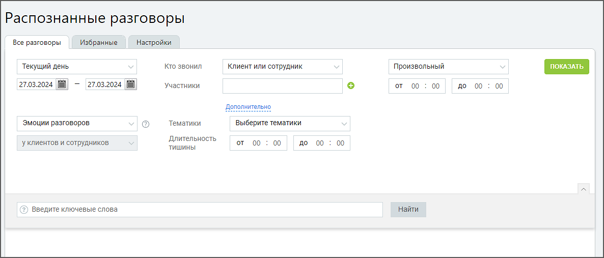
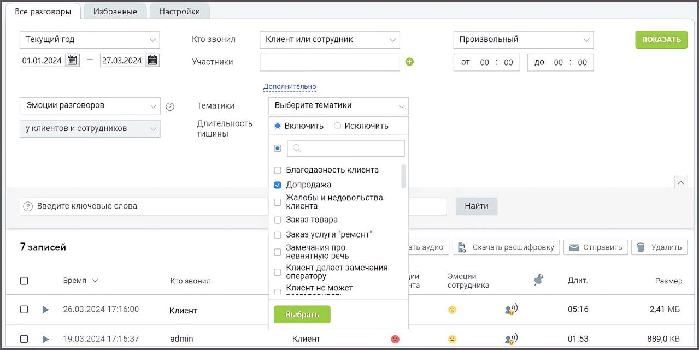

# 5.1. Все разговоры

> Трассировка: PDF §5.1 · сквозные стр. 67-69 · источники: ч.1 `kb/mango-product-docs/sources/speech-analytics/RECHEVAYA-ANALITIKA_Skoring_Rukovodstvo-polzovatelya_v.1.26.15.pdf` с.67-69.

При переходе на вкладку «Распознанные разговоры» в окне отображается панель фильтрации. На панели доступны следующие поля: Период – произвольный, текущий день, текущая неделя, текущий месяц, с прошлого месяца, с позапрошлого месяца, текущий год, весь период; Длительность разговора – по умолчанию установлена произвольная длительность разговора;

Кто звонил – определите, разговоры какой стороны (клиент или сотрудник) вы хотите отобразить. Если ни один сотрудник не выбран, список формируется по всем сотрудникам. Участники – укажите ФИО сотрудников или название группы, Выберите тематики – все тематики (в том числе неактивные). Возможен выбор как включенных, так и исключенных из поиска тематик:

| Если выбрано Включить, то в списке записей разговоров выводятся записи, на которые |
| --- |
| проставилась хотя бы одна из выбранных тематик. |

Речевая аналитика. Скоринг | v.1.26.15 67

| 8 800 555 55 22, mango-office.ru |  |
| --- | --- |
|  | mango@mangotele.com |

| Если выбрано Исключить, то не выводится ни одна запись, которая соответствует хотя бы |
| --- |
| одной из выбранных тематик. В списке разговоров будут только те записи, на которые не |
| проставилась ни одна из выбранных тематик. |

Эмоции разговоров – дополнительная настройка для фильтрации разговоров в зависимости от выбранной эмоции: негативно, позитивно, нейтрально. В таблице отчета отображаются соответствующими пиктограммами-смайликами. Эмоции определяются на основании звуков (тембра, громкости). При загрузке одноканальных аудиозаписей эмоции не отображаются. У клиента и сотрудников – у кого анализировать эмоции разговора. Этот фильтр выбран всегда. Длительность тишины – укажите интервал времени тишины в разговоре (в формате мм:сс), что может быть полезно для анализа качества обслуживания. В транскрибации и на плеере фрагменты тишины будут выделяться фоновым цветом. Строка для ввода поисковых запросов. Подробнее о том, как формулировать поисковые запросы, узнайте здесь. При вводе поискового запроса производится проверка на наличие каждого слова в словаре распознавания (с учетом словоформ). Если введенное слово отсутствует в словаре, оно выделяется красным цветом. Вероятно, в написании слова имеется ошибка, поэтому оно не может быть распознано.

После настройки необходимых фильтров и добавления ключевых слов нажмите кнопку Найти. Отобразится список разговоров, удовлетворяющих заданным условиям поиска. После нажатия на кнопку Прослушать, отображается встроенный плеер с записью разговора.

Если пользователь имеет ограниченные права доступа на прослушивание записей разговоров (например, «прослушивать только свои записи»), то в результатах поиска, по ключевым словам, будут только эти записи. ПРИМЕР: Требуется проконтролировать качество общения кассиров торговой сети с клиентами, а именно – предлагают ли кассиры дополнительно приобрести акционные товары. Выбирается тематика «Допродажа» и производится поиск по записям разговоров Сотрудников. В списке поисковой выдачи отразятся все записи, соответствующие настройкам тематики «Допродажа». Речевая аналитика. Скоринг | v.1.26.15 68

| 8 800 555 55 22, mango-office.ru |  |
| --- | --- |
|  | mango@mangotele.com |

Во вкладке «Все разговоры» в списке распознанные разговоры помечаются пиктограммой

Если по разговору есть расшифровка записи, он помечается пиктограммой . Клик по кнопке «Скачать аудио» позволяет скачать выбранную аудиозапись в формате mp3. Клик по кнопке «Скачать расшифровку» позволяет скачать расшифровку выбранной записи в формате pdf. Кнопка доступна только при наличии подключенного в ЛК инструмента «Текстовые расшифровки».

| Текстовые расшифровки записей удобны, если требуется быстро ознакомится с содержанием |
| --- |
| разговора. |

При подключении интеграций расшифровки разговоров, при необходимости, могут передаваться на внешние сервисы по API. Кнопка «Отправить» служит для пересылки выбранных записей на e-mail. Для удаления выбранных записей кликните по кнопке «Удалить» и подтвердите свое согласие на удаление. внимание При удалении записи разговоров вручную доступна опция сохранения их расшифровок. Если аудиозапись удалена, но расшифровка сохранена, данные разговоры будут включены в отчеты, однако воспроизведение звука для них будет недоступно.
