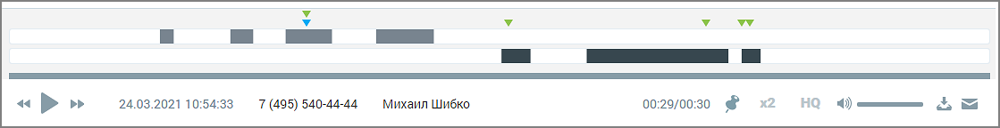
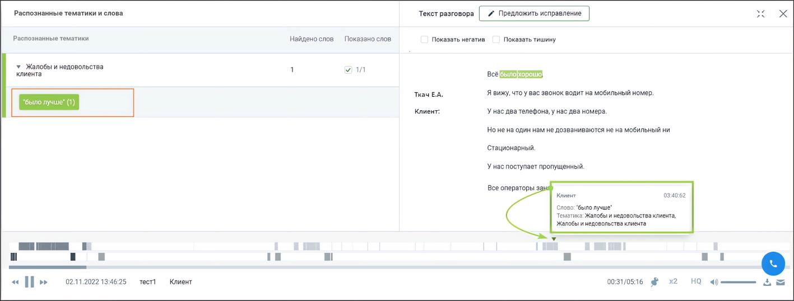
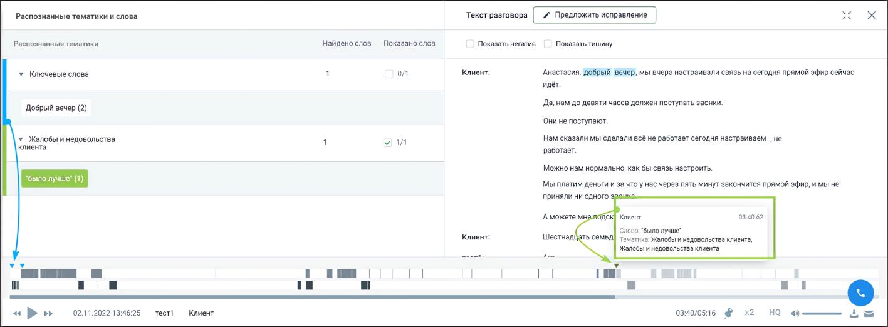
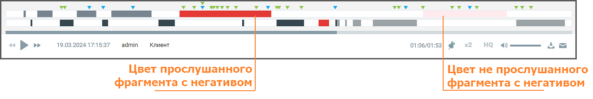
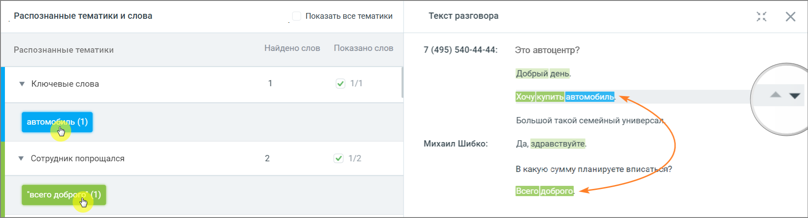
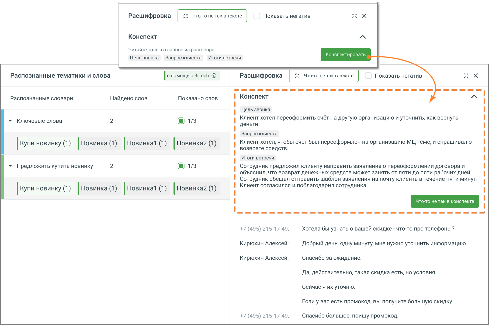
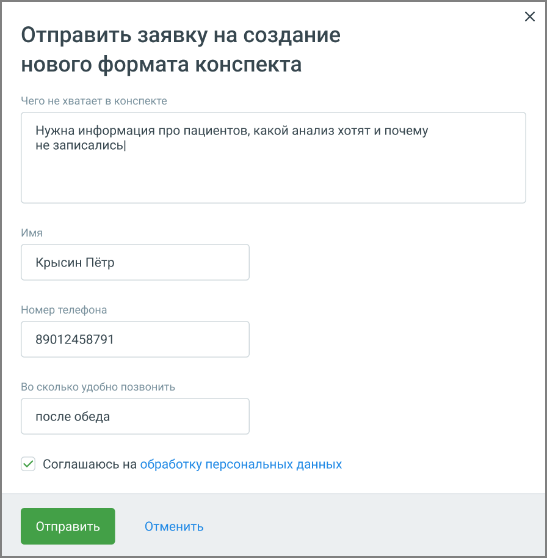

# 5.1.1. Метки на плеере при прослушивании записи разговора

> Трассировка: PDF §5.1.1 · сквозные стр. 69-73 · источники: ч.1 `kb/mango-product-docs/sources/speech-analytics/RECHEVAYA-ANALITIKA_Skoring_Rukovodstvo-polzovatelya_v.1.26.15.pdf` с.69-73.

записи разговора Для отображения результатов поиска в распознанных записях разговоров используется осциллограмма на встроенном плеере, с выделенными фрагментами разговора.

Речевая аналитика. Скоринг | v.1.26.15 69

| 8 800 555 55 22, mango-office.ru |  |
| --- | --- |
|  | mango@mangotele.com |

При наведении курсора в область плеера на тех участках разговора, где были вхождения терм, отображаются:

• метка для терм, найденных из строки ввода поисковых запросов;

• метка для терм из тематик. Плеер содержит основную информацию о звонке: • ФИО клиента; • Дата и время звонка; • Длительность записи. При необходимости нажмите:

• – приостановить/продолжить воспроизведение; переключиться на предыдущую/следующую запись;

• – добавить запись в список «избранных» и установить метку;

• – изменить скорость воспроизведения. Варианты – 1х / 1,5х / 2х;

• – включение функции шумоподавления. Наличие функции зависит от текущего тарифного плана ВАТС. Включение функции возможно только при установленном флаге «Подавлять шумы при прослушивании» на закладке «Настройки»;

• – изменить громкость воспроизведения;

• – скачать запись;

• – отправить запись на e-mail.

При наведении курсора на метки и плеера отображается всплывающее окно с указанием канала, в рамках которого была распознана терма, а также сама терма. Поиск по распознанным записям может осуществляться: • по термам в строке поиска (см. рис.1); • с учетом выбранных в фильтре тематик (см. рис.2). Соответственно будут различаться метки на осциллограмме встроенного плеера.

Рис.1. Результаты поиска терм заданной тематики, без строки поиска Речевая аналитика. Скоринг | v.1.26.15 70

| 8 800 555 55 22, mango-office.ru |  |
| --- | --- |
|  | mango@mangotele.com |

Рис.2 Результаты поиска терм заданной тематики, со строкой поиска ✓ Если во всплывающем окне осциллограммы в списке тематик выбрать какую-либо тематику, то на осциллограмме будут отображены метки, принадлежащие только этой тематике, и не будут отображены метки, принадлежащие другим тематикам из списка. ✓ Если во всплывающем окне осциллограммы в списке терм выбрать какую-либо из терм, то на осциллограмме будут отображены метки, принадлежащие только этой терме и не будут отображены метки, принадлежащие другим термам из списка. ✓ При отметке чек-бокса «Показать негатив» в транскрибации и на плеере фрагменты тишины или фрагменты разговора, определенные, как содержащие негатив, будут выделяться фоновым цветом.

Выбор метки на плеере переводит воспроизведение записи разговора на участок, соответствующий метке. Выбор термы или ключевого слова в блоке «Распознанные словари и слова» выделяет фрагмент

разговора, с этой термой/ключевым словом. Пиктограммы позволяют быстро переключаться между фрагментами, содержащими выбранные термы/ключевые слова.

Речевая аналитика. Скоринг | v.1.26.15 71

| 8 800 555 55 22, mango-office.ru |  |
| --- | --- |
|  | mango@mangotele.com |

Если услуга «Текстовые расшифровки» отключена, тексты разговоров на плеере не отображаются.

Клик по пиктограмме сворачивает окно записи разговора в компактный формат. Для

отображения окна в полной форме следует нажать на пиктограмму . Если в настройках Речевой аналитики включена услуга AI Конспекты, в разделе Оффлайновые записи становится доступна функция просмотра автоматически сформированных резюме звонков. внимание Функция доступна пользователям с доступом «Настройки распознавания сотрудников и номеров». Доступ настраивается в ЛК ВАТС → Безопасность и ограничения → Настройка доступа → [выбрать роль] → Речевая аналитика. Чтобы открыть конспект: 1. Перейдите в раздел Оффлайновые записи. Откройте нужный звонок. Нажмите кнопку Конспектировать. 2. В окне расшифровки звонка над текстом разговора сформируется Конспект – краткое содержание диалога, подготовленное AI. В нём будут выделены: • цель звонка, • запрос клиента, • итоги встречи.

Персональные данные клиентов из конспекта исключены. Речевая аналитика. Скоринг | v.1.26.15 72

<!-- изображение на стр. 73: байты не извлечены (PyMuPDF недоступен) -->

| 8 800 555 55 22, mango-office.ru |  |
| --- | --- |
|  | mango@mangotele.com |

Если в содержании конспекта что-то не соответствует реальному разговору, нажмите кнопку «Что- то не так в конспекте». Откроется форма, в которой можно: • оставить комментарий; • предложить, что добавить или изменить; • указать контактные данные для обратной связи.

<!-- изображение на стр. 73: байты не извлечены (PyMuPDF недоступен) -->

Также вы можете предложить свой вариант оформления резюме – собственный промт. Это полезно, если в стандартном конспекте не хватает информации или структура не соответствует задачам вашего бизнеса. Промт – это текстовая инструкция, по которой AI формирует краткое содержание разговора. Вы можете указать, какие элементы должны быть включены, что стоит убрать или изменить. Это позволяет настраивать конспекты под особенности вашего бизнеса, например, добавить причины отказа клиента, эмоциональную реакцию или этапы обработки запроса. Чтобы отправить предложение, откройте расшифровку любого звонка и нажмите кнопку Что-то не так в конспекте. Откроется форма обратной связи. В ней укажите, что именно вы хотите изменить, оставьте контактные данные и отметьте удобное время для связи. Отправленные заявки поступают в команду продукта и сохраняются в системе. На основе пользовательских предложений разрабатываются новые шаблоны, которые могут быть добавлены в список доступных форматов конспектов. Таким образом, вы получаете возможность влиять на работу AI и адаптировать резюме разговоров под потребности вашей компании.
