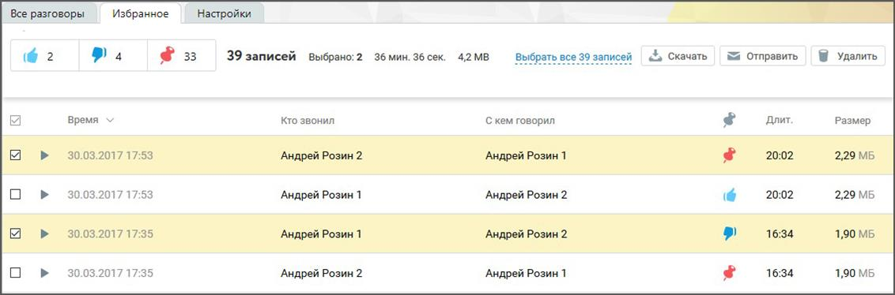

# 5.2. Избранное

> Трассировка: PDF §5.2 · сквозные стр. 73-74 · источники: ч.1 `kb/mango-product-docs/sources/speech-analytics/RECHEVAYA-ANALITIKA_Skoring_Rukovodstvo-polzovatelya_v.1.26.15.pdf` с.73-74.

Вкладка “Избранное” содержит список офлайновых записей разговоров, отмеченных метками. Все помеченные записи приводятся в порядке, который соответствует времени добавления метки к определенной записи. Таким образом, последняя запись, к которой была добавлена метка, отображается в верхней части списка, а запись, метка к которой была добавлена раньше всех, отображается последней. Речевая аналитика. Скоринг | v.1.26.15 73

| 8 800 555 55 22, mango-office.ru |  |
| --- | --- |
|  | mango@mangotele.com |

Предусмотрена фильтрация записей по меткам. Для этого следует щелкнуть по соответствующей кнопке в области фильтров. Действия по прослушиванию записей аналогичны описанным действиям в предыдущем подразделе.
