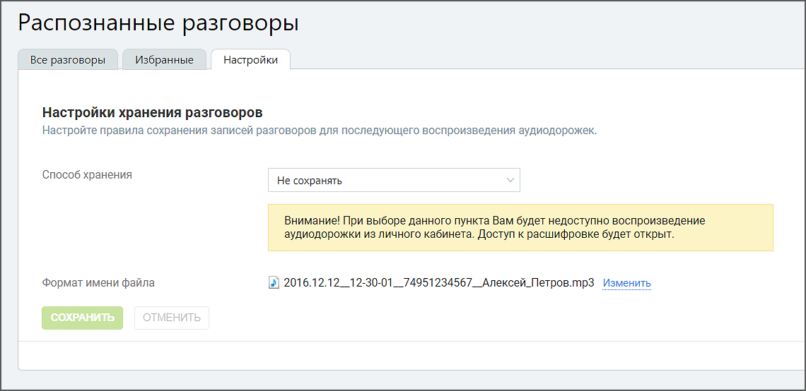

# 5.3. Настройки (офлайн скоринга)

> Трассировка: PDF §5.3 · сквозные стр. 74-75 · источники: ч.1 `kb/mango-product-docs/sources/speech-analytics/RECHEVAYA-ANALITIKA_Skoring_Rukovodstvo-polzovatelya_v.1.26.15.pdf` с.74-75.

В этой вкладке можно управлять параметрами хранения и пересылки, а также изменить формат имени файла записи разговора.

Пользователь может выбрать способ сохранения файлов: не сохранять или облачное хранилище. При отключении Личного кабинета записи разговоров становятся недоступны пользователю, но все еще могут находиться в файловом хранилище. Через 30 календарных дней записи полностью удаляются из файлового хранилища. Речевая аналитика. Скоринг | v.1.26.15 74

| 8 800 555 55 22, mango-office.ru |  |
| --- | --- |
|  | mango@mangotele.com |
