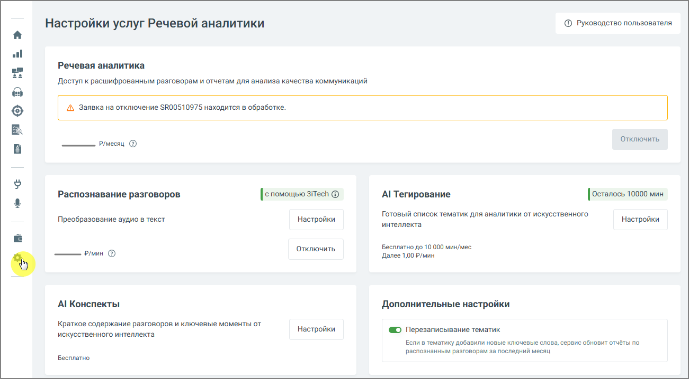

# 7.1. Настройки

> Трассировка: PDF §7.1 · сквозные стр. 80-81 · источники: ч.1 `kb/mango-product-docs/sources/speech-analytics/RECHEVAYA-ANALITIKA_Skoring_Rukovodstvo-polzovatelya_v.1.26.15.pdf` с.80-81.

Вкладка Настройки модуля "Речевая аналитика" содержит следующие блоки:

Услуга «Речевая аналитика» – отображается абонентская плата за услугу. Распознавание разговоров – отображается стоимость расшифровки и распознавания. AI-инструменты 1. AI Конспекты – если переключатель включен, данная услуга Речевой Аналитики позволяет автоматически формировать краткое содержание диалога и выделять ключевые моменты с помощью искусственного интеллекта. 2. AI Тегирование – услуга предоставляет возможность смыслового анализа разговоров на основе запросов к AI без подбора ключевых слов. Анализ разговоров с использованием AI- запросов доступен только при активированных услугах «Абонентская плата» и «Распознавание разговоров». Элементы настроек услуги: • Сотрудники: Выбор диапазона сотрудников для анализа. Пользователь может выбрать конкретных сотрудников для фильтрации разговоров. Необходимо убедиться, что выбранные для анализа сотрудники совпадают с теми, кто уже выбран для распознавания разговоров. • Направление звонка: Позволяет выбрать направление (входящие, исходящие или внутренние звонки) по которому разговоры будут фильтроваться для отправки на тегирование. внимание Стоимость услуги определяется на основе продолжительности анализируемых разговоров, а списание средств происходит каждую ночь. Речевая аналитика. Скоринг | v.1.26.15 80

| 8 800 555 55 22, mango-office.ru |  |
| --- | --- |
|  | mango@mangotele.com |
