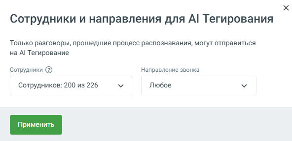

# 7.1.3. AI Тегирование

> Трассировка: PDF §7.1.3 · сквозные стр. 84-85 · источники: ч.1 `kb/mango-product-docs/sources/speech-analytics/RECHEVAYA-ANALITIKA_Skoring_Rukovodstvo-polzovatelya_v.1.26.15.pdf` с.84-85.

Блок AI Тегирование предназначен для анализа разговоров сотрудников с использованием технологий искусственного интеллекта. Сервис анализирует диалоги не только по ключевым словам, но и по смыслу, что позволяет получать более точную и детализированную аналитику. AI Тегирование доступно для клиентов с подключённой услугой распознавания разговоров и включено по умолчанию. Анализ разговоров выполняется в рамках поминутной тарификации.

Речевая аналитика. Скоринг | v.1.26.15 84

| 8 800 555 55 22, mango-office.ru |  |
| --- | --- |
|  | mango@mangotele.com |

Настройка сотрудников и направлений Для управления тем, какие разговоры будут анализироваться с использованием AI, используется кнопка Настройки. При нажатии открывается окно «Сотрудники и направления для AI Тегирования», в котором можно: • выбрать сотрудников, чьи разговоры будут отправляться на AI-анализ; для выбора доступны только те сотрудники, для которых включено распознавание разговоров; • указать направления звонков для анализа: любые, входящие, исходящие или внутренние. AI Тегирование применяется только к разговорам выбранных сотрудников. После выбора сотрудников и направлений необходимо нажать кнопку Применить. Данная настройка позволяет гибко управлять AI-анализом, фокусируясь на нужных сотрудниках и типах звонков, и получать релевантную аналитику без избыточной обработки разговоров.
