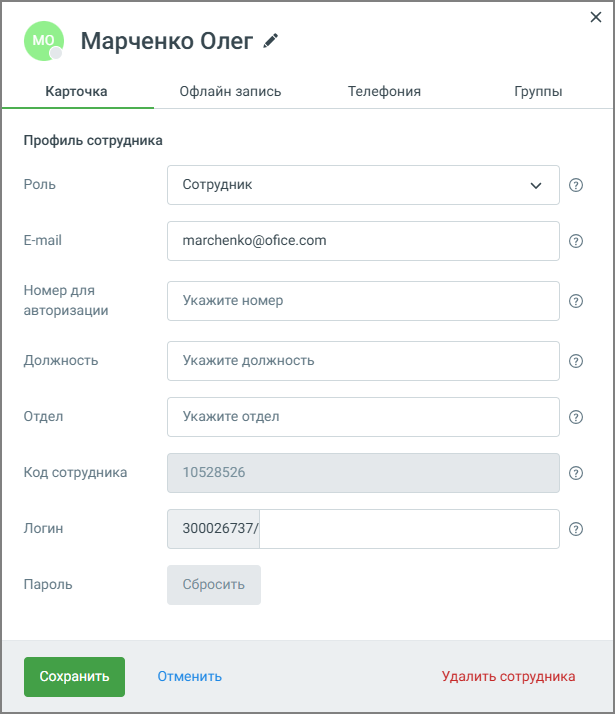
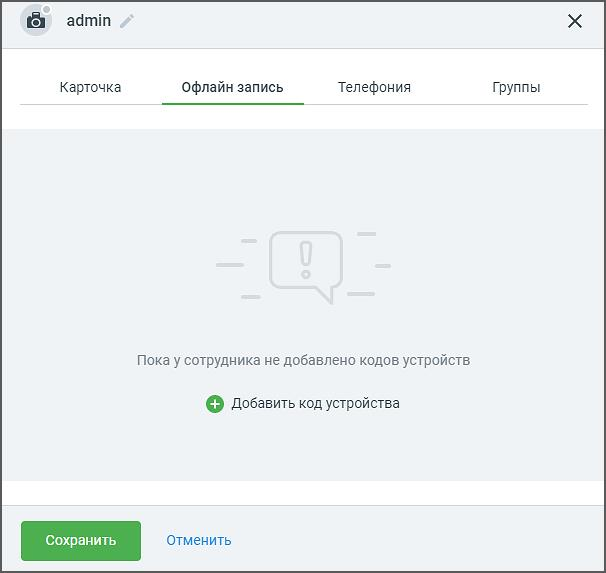
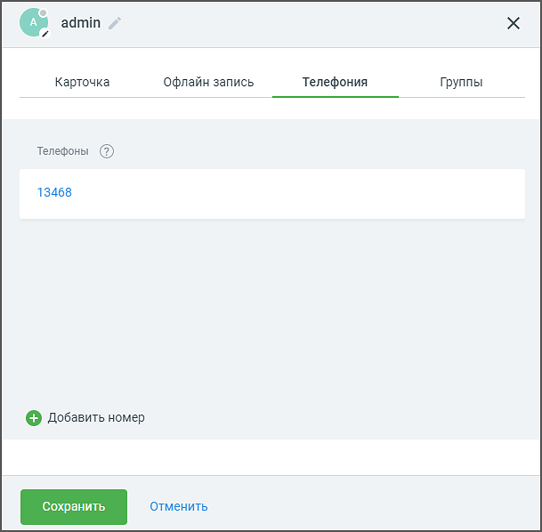

# 7.2.1. Вкладка «Сотрудники»

> Трассировка: PDF §7.2.1 · сквозные стр. 86-89 · источники: ч.1 `kb/mango-product-docs/sources/speech-analytics/RECHEVAYA-ANALITIKA_Skoring_Rukovodstvo-polzovatelya_v.1.26.15.pdf` с.86-89.

На вкладке содержится список сотрудников, добавленных в Личном кабинете РА.

На вкладке доступна следующая информация: • Просмотр списка сотрудников – позволяет видеть всех пользователей, подключённых к системе, вместе с их ролями и контактными данными. • Поиск сотрудников – помогает быстро найти сотрудника по имени или номеру телефона. • Экспорт – сохраняет текущий список сотрудников в файл для дальнейшего использования или архивирования. • Импорт – загружает сотрудников из файла, что удобно при массовом добавлении. • Фильтрация по отсутствующим данным – позволяет выбрать сотрудников без e-mail, без мобильного телефона или без обоих параметров. • Массовый выбор сотрудников – выделяет сотрудников, соответствующих выбранным критериям, для дальнейшего редактирования. • Редактирование данных сотрудника – при клике по имени сотрудника открывается карточка с его настройками, где можно изменить контактные данные и параметры доступа. Иконки предупреждений – показывают сотрудников без e-mail или мобильного телефона, необходимых для двухфакторной аутентификации, и другую информацию. Речевая аналитика. Скоринг | v.1.26.15 86

| 8 800 555 55 22, mango-office.ru |  |
| --- | --- |
|  | mango@mangotele.com |

Добавление сотрудника Клик по кнопке «Добавить сотрудника» открывает форму добавления сотрудника. Заполните поля формы и сохраните произведенные изменения.

В информационном окне «Сотрудник создан!» вы можете открыть и заполнить карточку сотрудника. Речевая аналитика. Скоринг | v.1.26.15 87

| 8 800 555 55 22, mango-office.ru |  |
| --- | --- |
|  | mango@mangotele.com |

На вкладке Офлайн запись добавьте код связанного устройства звукозаписи сотрудника. Код устройства быть уникальным в рамках Личного кабинета. Код устройства, с которого звонит сотрудник, необходим для идентификации системой сотрудника с помощью его устройства.

Во вкладке Телефония можно добавить или удалить номера телефонов сотрудников. Эти номера используются для определения Сотрудника, участвующего в разговоре. Речевая аналитика. Скоринг | v.1.26.15 88

| 8 800 555 55 22, mango-office.ru |  |
| --- | --- |
|  | mango@mangotele.com |

Добавьте сотрудника в одну из групп. Для этого на вкладке Группы необходимо предварительно создать одну или несколько групп. Также имеется возможность удалить Карточку и изменить ее название.
