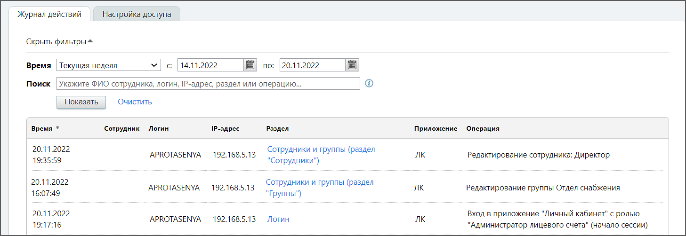

# 7.3.3. Вкладка «Журнал действий»

> Трассировка: PDF §7.3.3 · сквозные стр. 95-96 · источники: ч.1 `kb/mango-product-docs/sources/speech-analytics/RECHEVAYA-ANALITIKA_Skoring_Rukovodstvo-polzovatelya_v.1.26.15.pdf` с.95-96.

Данный отчет отображает информацию о действиях пользователей в Личном кабинете. Отчет формируется по указанному периоду. Выберите период или укажите его самостоятельно в полях «с» и «по». При необходимости заполните поле «Поиск». Допускается поиск по: • ФИО сотрудника; • логину вида xxxxxxxxx/name, где: o xxxxxxxxx - цифровой идентификатор; o name – логин пользователя; • IP-адресу; • названию раздела; • названию выполненной операции. внимание Поиск осуществляется по точному совпадению указанных данных. Обращайте внимание на последовательность слов в запросе. Для формирования отчета нажмите Показать. Пример отчета приведен на рисунке ниже.

Некоторые действия могут выполняться не сотрудником, а системой (например, отправка письма либо уведомления). В отчете такие действия помечаются как выполненные псевдо-пользователем «Система». Речевая аналитика. Скоринг | v.1.26.15 95

| 8 800 555 55 22, mango-office.ru |  |
| --- | --- |
|  | mango@mangotele.com |
