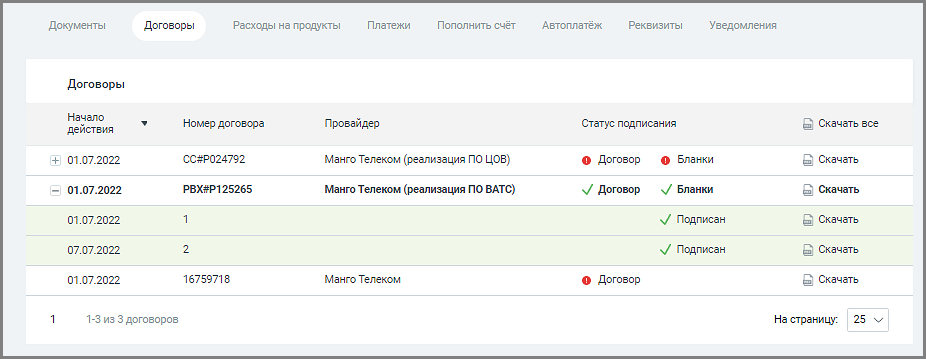
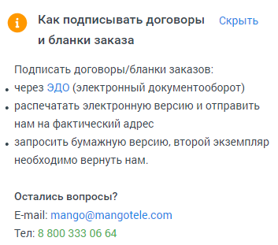

# 8.2. Договоры

> Трассировка: PDF §8.2 · сквозные стр. 118-119 · источники: ч.1 `kb/mango-product-docs/sources/speech-analytics/RECHEVAYA-ANALITIKA_Skoring_Rukovodstvo-polzovatelya_v.1.26.15.pdf` с.118-119.

В разделе отображается список договор пользователя, с возможностью скачивания документов. Видимость списка зависит от настроек прав доступа роли текущего пользователя. Список доступен также пользователям со стандартными ролями «Руководитель компании», «Бухгалтер» и «Администратор».

Таблица договоров содержит следующие поля:

Пиктограммы / – закрытый/открытый список бланков заказа, в составе договора. Если с договором есть хотя бы один связанный бланк заказа, то вначале строки договора отображается пиктограмма "+". При нажатии пиктограмма разворачивает список бланков заказа. Чтобы свернуть

список бланков кликните по пиктограмме ; Начало действия – начало действия договора. По умолчанию новые договора размещены в начале списка; Номер договора – номер заключенного договора; Название провайдера – провайдер, с которым заключен договор; Речевая аналитика. Скоринг | v.1.26.15 118

| 8 800 555 55 22, mango-office.ru |  |
| --- | --- |
|  | mango@mangotele.com |

Статус подписания – документ подписан, документ не подписан. Доступна сортировка по статусу. Скачать – сохраните документ, используя стандартные средства Windows; Скачать все – сохраните все документы, отображаемые в таблице выдачи. В случае наличия неподписанных документов справа от списка выводится предупреждение о возможном приостановлении услуг связи и информационное сообщение:

<!-- изображение на стр. 119: байты не извлечены (PyMuPDF недоступен) -->
