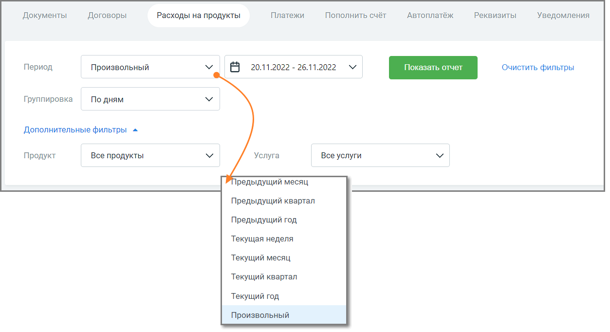
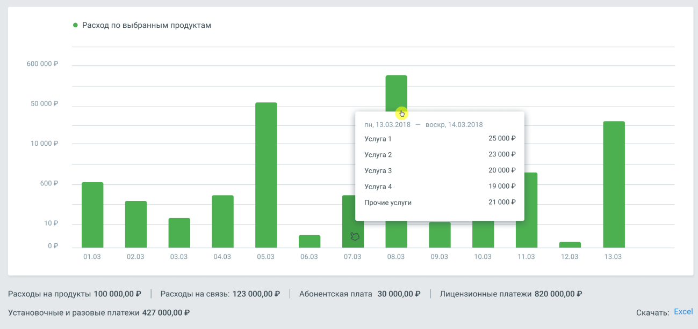

# 8.3. Расходы на продукт

> Трассировка: PDF §8.3 · сквозные стр. 119-123 · источники: ч.1 `kb/mango-product-docs/sources/speech-analytics/RECHEVAYA-ANALITIKA_Skoring_Rukovodstvo-polzovatelya_v.1.26.15.pdf` с.119-123.

Отчет Расходы на продукт позволяет просмотреть детализацию расходов по выбранному продукту за интересующий период времени. внимание Отчет Расходы на продукты отображается в ЛК только если на ЛК подключена соответствующая услуга. Отчет состоит из трех элементов: 1) Блок фильтров 2) Гистограмма 3) Таблица детализации Речевая аналитика. Скоринг | v.1.26.15 119

| 8 800 555 55 22, mango-office.ru |  |
| --- | --- |
|  | mango@mangotele.com |

Блок фильтров

Рис. Блок фильтров В блоке доступны для выбора следующие фильтры: Период – период данных, отображаемых в отчете: • быстрый выбор из выпадающего списка: ✓ предыдущий месяц – с первого по последнее число предыдущего месяца ✓ предыдущий квартал – с первого по последнее число предыдущего квартала ✓ предыдущий год – с первого по последнее число предыдущего года ✓ текущая неделя – с понедельника текущей недели по настоящее время ✓ текущий месяц – с первого числа текущего месяца по настоящее время ✓ текущий квартал – с первого числа текущего квартала по настоящее время ✓ текущий год – с первого числа текущего года по настоящее время ✓ произвольный период внимание Дату начала отчётного периода нельзя задать ранее, чем дата создания лицевого счёта. Группировка – группировка данных в отчете по дням, по месяцам; Продукт – список всех продуктов Личного кабинета пользователя, расходы по которым больше нуля; Услуга – список всех услуг для выбранных продуктов Личного кабинета пользователя, расходы по которым больше нуля. Клик по кнопке Показать формирует гистограмму и таблицу детализации. Клик по кнопке Очистить сбрасывает настройки фильтров. Речевая аналитика. Скоринг | v.1.26.15 120

| 8 800 555 55 22, mango-office.ru |  |
| --- | --- |
|  | mango@mangotele.com |

Гистограмма

Гистограмма содержит: • по оси X – значения фильтра "Группировка"; • по оси Y – сумму расходов в рублях. При наведении курсора мыши на столбец гистограммы отображается всплывающее окно с описанием периода, списком оказанных услуг и суммой расходов. Двойной клик на столбец гистограммы открывает окно с детализацией расходов.

Клик по пиктограмме разворачивает вложенные элементы отчета, по пиктограмме – сворачивает. Речевая аналитика. Скоринг | v.1.26.15 121

| 8 800 555 55 22, mango-office.ru |  |
| --- | --- |
|  | mango@mangotele.com |

Рис. Блоки 1 и 2 являются вложенными элементами отчета. Под блоком гистограммы содержится следующая информация: • Расходы на продукты – сумма всех расходов по выбранным продуктам за выбранный период; • Расходы на связь – сумма расходов на связь за выбранный период; • Абонентская плата – сумма расходов на абонентскую плату за выбранный период; • Лицензионные платежи – сумма расходов по лицензионным платежам выбранный период; • Установочные и разовые платежи – сумма расходов по установочным и разовым платежам за выбранный период; • Прочие услуги - сумма расходов по прочим услугам на ЛК за выбранный период. Клик на кнопку "Excel" открывает стандартное окно экспорта таблицы детализации в формате CSV (Excel). Таблица детализации Таблица содержит детализацию расходов по каждому продуктовому набору ЛК. Категории "Расходы на связь", "Абонентская плата", "Лицензионные платежи", "Установочные и разовые платежи" и "Прочие услуги" – представлены для каждого продукта ЛК. Речевая аналитика. Скоринг | v.1.26.15 122

| 8 800 555 55 22, mango-office.ru |  |
| --- | --- |
|  | mango@mangotele.com |

Рис. Блоки 1 и 2 являются вложенными элементами таблицы детализации. Таблица содержит детализацию данных, отсортированную согласно иерархии. Клик по

пиктограмме разворачивает вложенные элементы таблицы, по пиктограмме – сворачивает. Двойной клик на продукт или категорию открывает окно с детализацией расходов, аналогичное всплывающему окну в блоке гистограммы.
