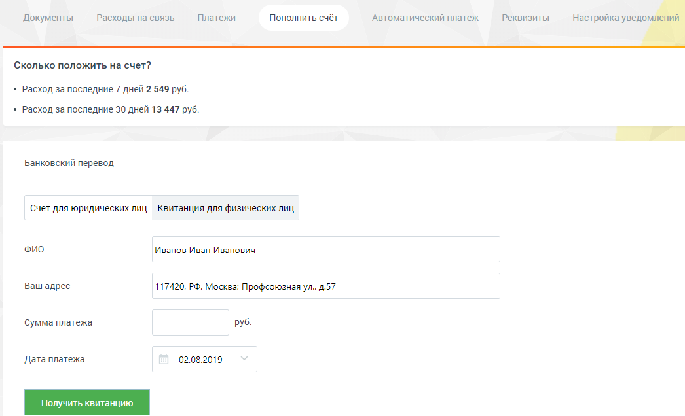

# 8.5.1.1. Для физических лиц

> Трассировка: PDF §8.5.1.1 · сквозные стр. 125-126 · источники: ч.1 `kb/mango-product-docs/sources/speech-analytics/RECHEVAYA-ANALITIKA_Skoring_Rukovodstvo-polzovatelya_v.1.26.15.pdf` с.125-126.

Перейдите на вкладку «Квитанция для физических лиц». Укажите ФИО, адрес, сумму платежа в соответствующих полях. Введите дату платежа, нажав значок календаря или в формате дд.мм.гггг. Речевая аналитика. Скоринг | v.1.26.15 125

| 8 800 555 55 22, mango-office.ru |  |
| --- | --- |
|  | mango@mangotele.com |

Нажмите кнопку Получить квитанцию. В зависимости от настроек браузера на новой странице или вкладке откроется готовая к печати квитанция. Проверьте правильность внесенных данных. Нажмите «Распечатать» (при необходимости используйте полосу прокрутки). Откроется стандартное диалоговое окно, позволяющее выбрать параметры печати.
