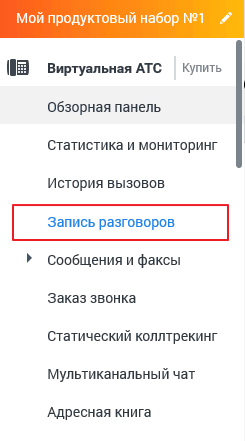

# 1. Общие сведения

> Трассировка: PDF §1 · сквозные стр. 5-8 · источники: ч.1 `kb/mango-product-docs/sources/speech-analytics/RECHEVAYA-ANALITIKA_VATS-_-Skoring-1.26.18.pdf` с.5-8.

MANGO OFFICE предоставляет пользователям возможность использовать Речевую аналитику ВАТС совместно с офлайн скорингом. Речевая аналитика «ВАТС & Офлайн скоринг» распознает как текущие вызовы, так и ранее записанные и загруженные в файловое хранилище разговоры, и производит поиск — вручную или автоматически — необходимой информации в разговоре. Как работает поиск по распознанным записям разговоров, читайте здесь. Рабочая область раздела Речевая аналитика содержит следующие вкладки: Отчеты Тегирование разговоров Офлайн-скоринг Текстовые коммуникации Настройки ИИ Помощники Расходы Речевой аналитики ВНИМАНИЕ! Для подключения услуги «Офлайн-скоринг» обратитесь к своему Персональному менеджеру. После подключения услуги пользователю доступны следующие функции: • Поиск в текстовых сообщениях и в распознанных записях разговоров заданных слов и выражений • Автоматическое проставление тематики разговора • Текстовая расшифровка аудиозаписей разговора • Составление отчетов • Получение уведомлений ВНИМАНИЕ! Для распознавания Речевой аналитикой звонков необходимо подключить Запись разговоров. Речевая аналитика. ВАТС & Офлайн скоринг | v.1.26.18 5

| 8 800 555 55 22, mango-office.ru |  |
| --- | --- |
|  | mango@mangotele.com |

Речевая аналитика. ВАТС & Офлайн скоринг | v.1.26.18 6

| 8 800 555 55 22, mango-office.ru |  |
| --- | --- |
|  | mango@mangotele.com |

Если в настройках способа хранения записей разговоров пользователем выбран способ Не хранить в облаке, отправлять на e-mail, Речевая аналитика может распознавать аудиозаписи, а также использовать их для построения отчетов. Однако поиск записей разговоров, по ключевым словам, в этом случае невозможен. Параметр Качество записи на работу Речевой аналитики не влияет. Подробнее о подключении и настройках Записи разговоров читайте в Справочнике ВАТС. Речевая аналитика. ВАТС & Офлайн скоринг | v.1.26.18 7

| 8 800 555 55 22, mango-office.ru |  |
| --- | --- |
|  | mango@mangotele.com |
