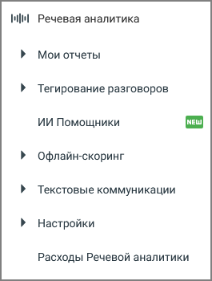

# 2.2. Подключение услуги в платном режиме

> Трассировка: PDF §2.2 · сквозные стр. 11-13 · источники: ч.1 `kb/mango-product-docs/sources/speech-analytics/RECHEVAYA-ANALITIKA_VATS-_-Skoring-1.26.18.pdf` с.11-13.

режиме Для подключения услуги "Речевая аналитика" последовательно перейдите в подраздел Речевая аналитика → Настройки. После щелчка по кнопке Подключить полную версию появляется всплывающее окно с детальным описанием расходов на подключение услуги.

Стоимость услуг расшифровки и распознавания разговора зависит от версии ВАТС. Подробнее о версии продукта и тарифах здесь. Всплывающее окно содержит следующие настройки: 1) Доступ к разделу Речевая аналитика – в рамках этой платы пользователь получает возможность пользоваться функционалом модуля «Речевая аналитика». Списание Речевая аналитика. ВАТС & Офлайн скоринг | v.1.26.18 11

| 8 800 555 55 22, mango-office.ru |  |
| --- | --- |
|  | mango@mangotele.com |

абонентской платы происходит ежедневно. Для удобства пользователя распознанные разговоры могу быть расшифрованы и представлены в виде текста. Для получения расшифровки разговора, необходимо: чтобы на момент совершения вызова на ВАТС была подключена услуга "Распознавание". 2) Распознавание разговоров – плата за распознавание снимается за фактическое количество распознанных минут аудиозаписей. Распознавание начинает работать сразу после его включения и распространяется только на новые записанные разговоры. Запись разговора не распознается мгновенно – допускается задержка по времени в несколько часов. При первом подключении услуги “Речевая аналитика” обязательно подключите распознавание разговоров. 3) Выбор технологии распознавания – предлагается две технологии на выбор: • 3iTech • Yandex SpeechKit В дальнейшем пользователь может сменить технологию распознавания. Ознакомьтесь с условиями оплаты и нажмите Подключить. После нажатия кнопки Подключить услуга активируется, а пользователь перенаправляется на страницу Настройки. На боковой навигационной панели ВАТС вам будет доступно меню:

Отображение меню может различаться в зависимости от подключенных продуктов и услуг. Подробнее о настройках распознавания записей разговоров узнайте здесь. Пользователь может изменить ранее установленные настройки подключения. Для этого перейдите в раздел Настройки, введите новые данные и сохраните изменения. Речевая аналитика. ВАТС & Офлайн скоринг | v.1.26.18 12

| 8 800 555 55 22, mango-office.ru |  |
| --- | --- |
|  | mango@mangotele.com |
