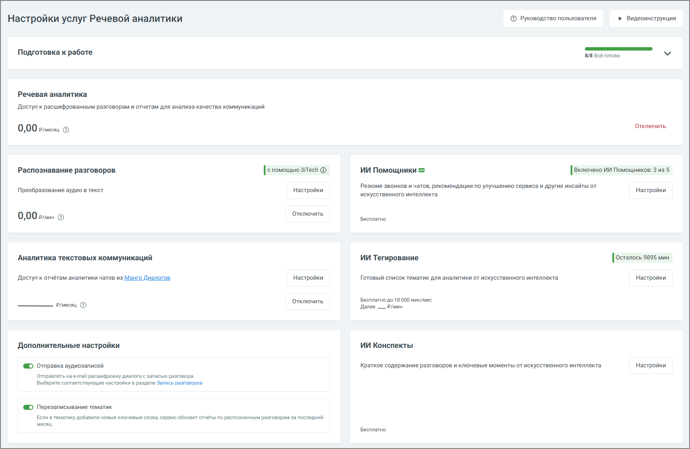

# 3. Настройки

> Трассировка: PDF §3 · сквозные стр. 13-14 · источники: ч.1 `kb/mango-product-docs/sources/speech-analytics/RECHEVAYA-ANALITIKA_VATS-_-Skoring-1.26.18.pdf` с.13-14.

Вкладка Настройки модуля Речевая аналитика содержит блок онбординга, а также следующие блоки.

Услуга «Речевая аналитика» – отображается абонентская плата за услугу. Распознавание разговоров – отображается стоимость расшифровки и распознавания аудиозаписей разговоров. В настройках можно настроить условия распознавания аудиозаписей разговоров и выбрать технологию распознавания. Пользователь может отправлять на распознавание только нужные звонки. Аналитика текстовых коммуникаций – выбор тарифа и сотрудников, чьи текстовые коммуникации будут анализироваться. ИИ Инструменты 1. ИИ Помощник – инструмент для автоматического анализа диалогов по заданным правилам, который выдаёт не только краткое содержание, но также полезные выводы и рекомендации. 2. ИИ Конспекты – если переключатель включен, данная услуга Речевой Аналитики позволяет автоматически формировать краткое содержание диалога и выделять ключевые моменты с помощью искусственного интеллекта. 3. ИИ Тегирование – услуга предоставляет возможность смыслового анализа разговоров на основе запросов к ИИ без подбора ключевых слов. Анализ разговоров с использованием ИИ-запросов доступен только при активированных услугах «Абонентская плата» и «Распознавание разговоров». Элементы настроек услуги: • Сотрудники: Выбор диапазона сотрудников для анализа. Пользователь может выбрать конкретных сотрудников для фильтрации разговоров. Необходимо Речевая аналитика. ВАТС & Офлайн скоринг | v.1.26.18 13

| 8 800 555 55 22, mango-office.ru |  |
| --- | --- |
|  | mango@mangotele.com |

убедиться, что выбранные для анализа сотрудники совпадают с теми, кто уже выбран для распознавания разговоров. • Направление звонка: Позволяет выбрать направление (входящие, исходящие или внутренние звонки) по которому разговоры будут фильтроваться для отправки на тегирование. внимание Стоимость услуги определяется на основе продолжительности анализируемых разговоров, а списание средств происходит каждую ночь. Все действия, произведенные в настройках Речевой аналитики, отражаются в Личном кабинете пользователя ВАТС в разделе Безопасность и ограничения/Журнал действий. Для удобного и последовательного ознакомления с функционалом Речевой аналитики разработан блок онбординга, который помогает быстро настроить все ключевые параметры и начать работу с сервисом.
