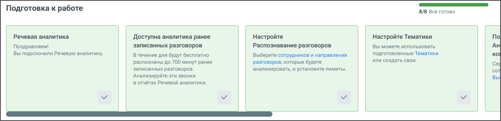

# 3.1. Шаги онбординга

> Трассировка: PDF §3.1 · сквозные стр. 14-15 · источники: ч.1 `kb/mango-product-docs/sources/speech-analytics/RECHEVAYA-ANALITIKA_VATS-_-Skoring-1.26.18.pdf` с.14-15.

В верхней части вкладки Настройки модуля находится блок онбординга, содержащего все этапы настроек Речевой аналитики.

Онбординг разработан для удобного и последовательного ознакомления с функционалом, помогая быстро настроить все ключевые параметры и начать работу с сервисом. Шкала прогресса онбординга отображает выполнение каждого шага подключения Речевой аналитики. 1. Речевая аналитика Поздравляем! Вы подключили модуль Речевая аналитика — теперь вы можете получать ценную информацию из разговоров с клиентами. Начните с простых шагов ниже, чтобы использовать возможности модуля по максимуму. 2. Настройте Распознавание разговоров Выберите сотрудников и направления звонков, которые хотите анализировать, и задайте лимиты. Зачем это нужно: вы контролируете, какие разговоры обрабатываются — и не расходуете минуты впустую. 3. Настройте ИИ Тематики Выберите готовые ИИ-тематики или отправьте заявку на создание своих. Зачем это нужно: вы получаете аналитику, которая полностью соответствует бизнес-задачам. 4. Настройте Тематики Используйте готовые Тематики или создайте собственные — по темам, важным именно для вашего бизнеса. Клик по ссылке открывает страницу «Тематики» для редактирования или добавления новых тематик. Речевая аналитика. ВАТС & Офлайн скоринг | v.1.26.18 14

| 8 800 555 55 22, mango-office.ru |  |
| --- | --- |
|  | mango@mangotele.com |

Зачем это нужно: вы получаете отчетность по нужным вам признакам — например, «жалоба», «отказ», «продажа». 5. Подключите и настройте Аналитику текстовых коммуникаций Анализируйте переписки в чатах: выберите сотрудников и подходящий тариф. Клик по кнопке Подключить открывает всплывающее окно "Выберите тариф и сотрудников". Зачем это нужно: вы увидите, как общаются сотрудники в мессенджерах и на сайте, и сможете улучшить качество общения.

Для сворачивания онбординга нажмите на пиктограмму .
