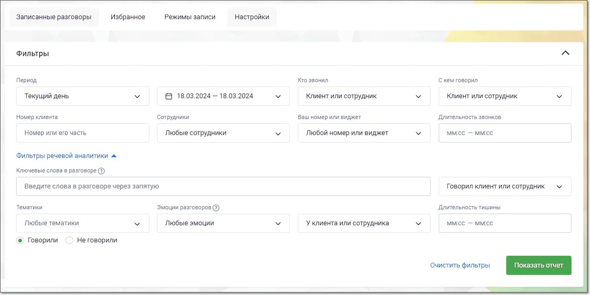
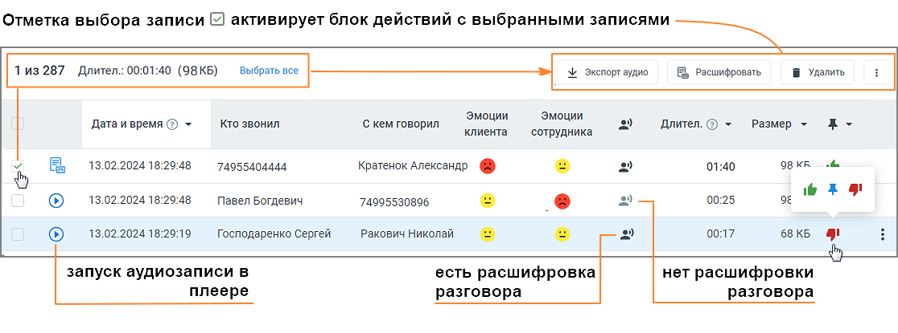

# 5.1. Поля формы модуля поиска в записях разговоров

> Трассировка: PDF §5.1 · сквозные стр. 36-38 · источники: ч.1 `kb/mango-product-docs/sources/speech-analytics/RECHEVAYA-ANALITIKA_VATS-_-Skoring-1.26.18.pdf` с.36-38.

записях разговоров Во вкладке «Записанные разговоры» раздела Запись разговоров ЛК ВАТС можно просмотреть и отсортировать информацию, а также прослушать и скачать записанные разговоры. Для поиска записанных разговоров воспользуйтесь фильтрами: 1) Из выпадающего списка выберите период отчета либо укажите произвольный; 2) Укажите значение в поле «Кто звонил»: Клиент либо Сотрудник; • Для значения «Клиент» укажите часть номера или номер, с которого звонил клиент; • Для значения «Сотрудник» выберите группу, конкретного сотрудника либо выберите значение «Любой сотрудник»; 3) Аналогичным образом укажите значения для поля «С кем говорил»; 4) Укажите номер или виджет Манго Диалоги, на который осуществился дозвон; 5) При необходимости укажите длительность беседы: предусмотрена возможность выбора определенной длительности либо ввода произвольной длины разговора в формате мм:сс.; Дополнительные фильтры Речевой аналитики: 6) Поиск по распознанным записям разговоров. Введите ключевое слово или словосочетание, которое вы хотите найти в разговоре (например, "акция", "доставка", "оплата"). Нажмите кнопку "Enter", чтобы слово, которое вы ввели, стало поисковым тегом. Разрешенные для ввода в данное поле символы: • Кавычки. " " и « » • Дефис (тире) • Запятая • Буквы (кириллица, латиница) • Пробел Поиск доступен, если на ВАТС подключена услуга «Распознавание разговоров». ПРИМЕР: Требуется выяснить интерес покупателей к акции “Скоро лето“. Вводим в поле поиска запрос “скоро лето”, выбираем канал Клиент и получаем список распознанных записей разговоров, где клиенты интересовались акцией. Далее можно прослушать записи и выяснить степень заинтересованности клиента и другую информацию. 7) Выберите, кто говорил эти слова: клиент или сотрудник. Также доступен вариант "никто не говорил". 8) Выберите тематику разговора (например, "продажи", "поддержка", "технические вопросы"). Речевая аналитика. ВАТС & Офлайн скоринг | v.1.26.18 36

| 8 800 555 55 22, mango-office.ru |  |
| --- | --- |
|  | mango@mangotele.com |

9) Выберите, хотите ли вы найти разговоры, относящиеся или не относящиеся к данным тематикам: • Если выбрано Говорили, то в списке записей разговоров выводятся записи, на которые проставилась хотя бы одна из выбранных тематик. • Если выбрано Не говорили, то не выводится ни одна запись, которая соответствует хотя бы одной из выбранных тематик. В списке разговоров будут только те записи, на которые не проставилась ни одна из выбранных тематик. Этот вариант может быть полезен, например, при выявлении – кто из сотрудников забывает предлагать акционные продукты в разговоре с клиентом. 10) Выберите эмоции, которые были выражены в разговоре: "любые эмоции", "негативные", "нейтральные". Эмоции разговоров определяет специальный алгоритм искусственного интеллекта, который анализирует как акустические (тембр, громкость), так и лингвистические характеристики. 11) Если выбраны "негативные" или "нейтральные" эмоции, можно указать, кто именно - клиент или сотрудник - проявил эти эмоции в ходе разговора. 12) Укажите длительность тишины. Изучение интервалов тишины может помочь руководителю выявить узкие места в рабочих процессах и процедурах обслуживания клиентов. Нажмите Показать отчет для формирования списка записанных разговоров, удовлетворяющего условиям фильтров. Нажатие кнопки Очистить фильтры сбрасывает выбранные фильтры. Если пользователь имеет ограниченные права доступа на прослушивание записей разговоров (например, “прослушивать только свои записи”), то в результатах поиска по ключевым словам будут только эти записи.

При выборе одной или нескольких записей становятся доступными следующие действия: • Экспорт аудио – скачать выбранные записи на компьютер пользователя (не более 1 ГБ единоразово); • Расшифровать – отправить выбранные записи на расшифровку «Речевой аналитикой». После подключения Речевой аналитики пользователю не нужно дожидаться, пока накопятся записи разговоров для распознавания. Кнопка «Расшифровать» дает возможность сразу отправить на распознавание из ЛК ВАТС уже накопленные в облачном хранилище записи. • Удалить – удалить выбранные записи без возможности восстановления. Речевая аналитика. ВАТС & Офлайн скоринг | v.1.26.18 37

| 8 800 555 55 22, mango-office.ru |  |
| --- | --- |
|  | mango@mangotele.com |

внимание При удалении записи разговоров вручную доступна опция сохранения их расшифровок. Если аудиозапись удалена, но расшифровка сохранена, данные разговоры будут включены в отчеты, однако воспроизведение звука для них будет недоступно.

Под пиктограммой доступны следующие опции: • Отправить на e-mail – отправить выбранные записи на e-mail; • Экспорт расшифровок – скачать текстовую расшифровку записей (доступно, если на ВАТС подключена услуга Распознавание разговоров и запись расшифрована); Также при выборе одной или нескольких записей выполняется подсчет общей длительности разговоров и объем файлов.

Для того, чтобы добавить запись разговора в список «избранных», следует в строке щелкнуть в

области столбца с пиктограммой и выбрать одну из следующих меток:

• – метка «Хороший звонок»;

• – метка «Плохой звонок»;

• – метка «В избранное». Кликните по метке, чтобы ее снять.
