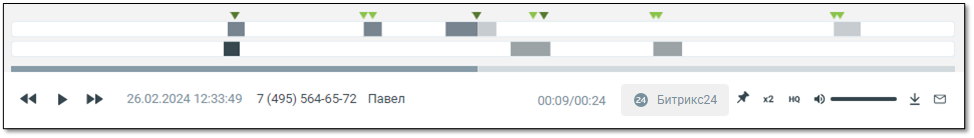
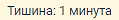
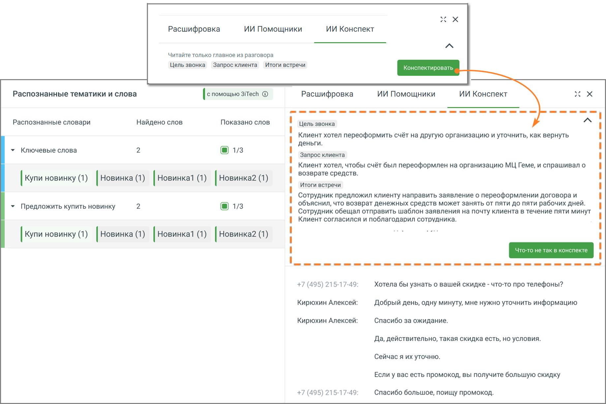

# 5.2. Прослушивание записей

> Трассировка: PDF §5.2 · сквозные стр. 38-44 · источники: ч.1 `kb/mango-product-docs/sources/speech-analytics/RECHEVAYA-ANALITIKA_VATS-_-Skoring-1.26.18.pdf` с.38-44.

Для прослушивания записи следует нажать на иконку напротив наименования нужной записи.

При этом иконка меняет вид на , что свидетельствует о том, что запись была добавлена в список воспроизведения в плеере. Одновременно в плеер допускается добавить не более одной записи.

Пиктограмма означает, что доступна только текстовая расшифровка звонка.

Запись, которая воспроизводится на данный момент, обозначается пиктограммой . Для управления прослушиванием используется встроенный плеер. Для отображения результатов поиска в распознанных записях разговоров используется осциллограмма на встроенном плеере, с выделенными фрагментами разговора. Речевая аналитика. ВАТС & Офлайн скоринг | v.1.26.18 38

| 8 800 555 55 22, mango-office.ru |  |
| --- | --- |
|  | mango@mangotele.com |

В области плеера на тех участках разговора, где были вхождения ключевых слов, отображаются метки:

1) для ключевых слов, найденных из строки ввода поисковых запросов

2) для ключевых слов (терм) из пользовательских тематик

3) для ключевых слов (терм) из ИИ-тематик Если в левом блоке «Распознанные словари и слова» отметить какой-либо чекбокс, то в правом блоке «Текст разговора» ключевые слова будут визуально выделяться. Метки на осциллограмме, соответствующие выбранному чекбоксу, также будут визуально выделяться более темным цветом:

(см. пример 1 на рисунке ниже)

Если чекбокс не отмечен (см. пример 2 на рисунке ниже), метка не меняет цвет.

Результаты поиска ключевых слов, заданных в строке поиска, с учетом тематик (инструмент расшифровки разговора включен).

Иконкой в блоке Распознанные тематики и слова обозначаются ИИ тематики.

При наведении курсора на метки плеера отображается всплывающее окно с указанием канала, в рамках которого была распознаны ключевые слова, а также сами ключевые слова. Речевая аналитика. ВАТС & Офлайн скоринг | v.1.26.18 39

| 8 800 555 55 22, mango-office.ru |  |
| --- | --- |
|  | mango@mangotele.com |

Выбор метки на плеере переводит воспроизведение записи разговора на участок, соответствующий метке.

Если разговор содержит несколько одинаковых терм или ключевых слов, пиктограммы позволяют быстро переключаться между фрагментами, содержащими выбранные термы/ключевые слова. Предварительно в левом блоке «Распознанные словари и слова» необходимо отметить соответствующие чекбоксы.

Если услуга «Расшифровка разговоров» отключена, тексты разговоров на плеере не отображаются. При отметке чек-боксов «Показать негатив» в транскрибации и на плеере разговора фрагменты, определенные, как содержащие негатив, будут выделяться фоновым цветом.

Если разговор содержит интервалы тишины, заданные в фильтрах, в транскрибации и на плеере

фрагменты тишины будут выделяться фоновым цветом.:

Клик по пиктограмме сворачивает окно записи разговора в компактный формат. Для

отображения окна в полной форме следует нажать на пиктограмму . При закрытии ВАТС аудиозаписи разговоров становятся недоступны пользователю, но все еще находятся в файловом хранилище. Через 30 календарных дней аудиозаписи полностью удаляются из файлового хранилища. Плеер содержит основную информацию о звонке: • ФИО клиента; • Дата и время звонка; • Длительность записи. При необходимости нажмите: Речевая аналитика. ВАТС & Офлайн скоринг | v.1.26.18 40

| 8 800 555 55 22, mango-office.ru |  |
| --- | --- |
|  | mango@mangotele.com |

• – приостановить\продолжить воспроизведение; переключиться на предыдущую\следующую запись;

• – перейти в CRM для ознакомления со статусом клиента. Включение функции возможно только если подключена интеграция с Bitrix24 (расширенный пакет), а также настроена передача данных в Речевую аналитику.

• – добавить запись в список «избранных» и установить метку;

• – изменить скорость воспроизведения. Варианты 1х / 1,5х / 2х;

• – включение функции шумоподавления. Наличие функции записит от текущего тарифного плана ВАТС. Включение функции возможно только при установленном флаге «Подавлять шумы при прослушивании» на закладке «Настройки»;

• – изменить громкость воспроизведения;

• – скачать запись;

<!-- изображение на стр. 41: байты не извлечены (PyMuPDF недоступен) -->

• – отправить запись на e-mail. При закрытии ВАТС аудиозаписи разговоров становятся недоступны пользователю, но все еще находятся в файловом хранилище. Через 30 календарных дней аудиозаписи полностью удаляются из файлового хранилища. Если в настройках Речевой аналитики включена услуга ИИ Конспекты, в разделе Запись разговоров становится доступна функция просмотра автоматически сформированных резюме звонков. внимание Функция доступна пользователям с доступом «Настройки распознавания сотрудников и номеров». Доступ настраивается в ЛК ВАТС → Безопасность и ограничения → Настройка доступа → [выбрать роль] → Речевая аналитика. Чтобы открыть конспект: 1. Перейдите в раздел Запись разговоров. Откройте нужный звонок. Нажмите кнопку Конспектировать. 2. В окне расшифровки звонка над текстом разговора сформируется Конспект — краткое содержание диалога, подготовленное ИИ. В нём будут выделены: • цель звонка, • запрос клиента, • итоги встречи. 3. Персональные данные клиентов из Конспекта исключены. Речевая аналитика. ВАТС & Офлайн скоринг | v.1.26.18 41

<!-- изображение на стр. 42: байты не извлечены (PyMuPDF недоступен) -->

| 8 800 555 55 22, mango-office.ru |  |
| --- | --- |
|  | mango@mangotele.com |

<!-- изображение на стр. 42: байты не извлечены (PyMuPDF недоступен) -->

Если в содержании конспекта что-то не соответствует реальному разговору, нажмите кнопку «Что- то не так в конспекте». Откроется форма, в которой можно: • оставить комментарий; • предложить, что добавить или изменить; • указать контактные данные для обратной связи.

<!-- изображение на стр. 42: байты не извлечены (PyMuPDF недоступен) -->

Речевая аналитика. ВАТС & Офлайн скоринг | v.1.26.18 42

<!-- изображение на стр. 43: байты не извлечены (PyMuPDF недоступен) -->

| 8 800 555 55 22, mango-office.ru |  |
| --- | --- |
|  | mango@mangotele.com |

Также вы можете предложить свой вариант оформления резюме – собственный промт. Это полезно, если в стандартном конспекте не хватает информации или структура не соответствует задачам вашего бизнеса. Промт — это текстовая инструкция, по которой ИИ формирует краткое содержание разговора. Вы можете указать, какие элементы должны быть включены, что стоит убрать или изменить. Это позволяет настраивать конспекты под особенности вашего бизнеса, например, добавить причины отказа клиента, эмоциональную реакцию или этапы обработки запроса. Чтобы отправить предложение, откройте расшифровку любого звонка и нажмите кнопку Что-то не так в конспекте. Откроется форма обратной связи. В ней укажите, что именно вы хотите изменить, оставьте контактные данные и отметьте удобное время для связи. Отправленные заявки поступают в команду продукта и сохраняются в системе. На основе пользовательских предложений разрабатываются новые шаблоны, которые могут быть добавлены в список доступных форматов конспектов. Таким образом, вы получаете возможность влиять на работу ИИ и адаптировать резюме разговоров под потребности вашей компании. Речевая аналитика. ВАТС & Офлайн скоринг | v.1.26.18 43

<!-- изображение на стр. 44: байты не извлечены (PyMuPDF недоступен) -->

| 8 800 555 55 22, mango-office.ru |  |
| --- | --- |
|  | mango@mangotele.com |
