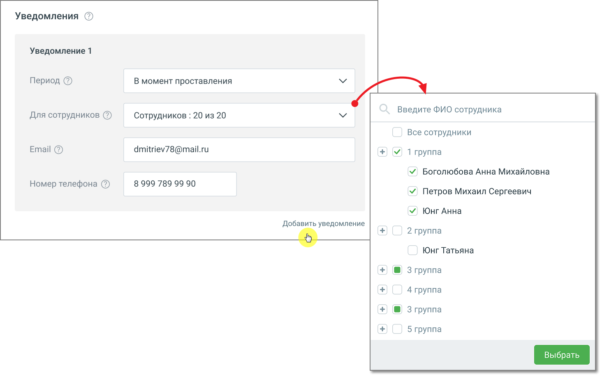

# 6.2.3. Настройка уведомлений

> Трассировка: PDF §6.2.3 · сквозные стр. 49-51 · источники: ч.1 `kb/mango-product-docs/sources/speech-analytics/RECHEVAYA-ANALITIKA_VATS-_-Skoring-1.26.18.pdf` с.49-51.

При добавлении тематики пользователь задает ряд условий. Если срабатывают все заданные условия и звонок отмечается на соответствие тематике, пользователь получает уведомление по электронной почте или посредством СМС-сообщения. Речевая аналитика. ВАТС & Офлайн скоринг | v.1.26.18 49

| 8 800 555 55 22, mango-office.ru |  |
| --- | --- |
|  | mango@mangotele.com |

Выпадающий список выбора уведомлений содержит значения: Период: • Не выбрано – установлено по умолчанию; • В момент проставления – при выборе этого значения вам понадобится указать действующий адрес электронной почты, на который будут поступать уведомления о простановке звонку тематики; • За прошлый день – уведомление о проставлении звонкам тематик будут поступать один раз в день, в 11 часов по московскому времени. При выборе этого значения вам также необходимо указать действующий адрес электронной почты и/или номер телефона для СМС-сообщений; • За прошлую неделю – уведомление о проставлении звонкам тематик будут поступать каждый понедельник, в 11 часов по московскому времени. При выборе этого значения необходимо указать действующий адрес электронной почты и/или номер телефона для СМС-сообщений (дополнительной оплаты доставки СМС-сообщений не требуется); Для сотрудников: выбор списка сотрудников/групп, в разговорах которых проверяется срабатывание текущей тематики. E-mail – адрес электронной почты, на который предусмотрена отправка уведомлений. Номер телефона – номер, на который предусмотрена отправка смс-уведомлений. Кнопка «Добавить уведомление» – добавление нового уведомления. Допустимое количество уведомлений для тематики не более 5. После установки обновления модуля «Речевая аналитика» параметры уведомлений, настроенные до обновления, сохраняются. Речевая аналитика. ВАТС & Офлайн скоринг | v.1.26.18 50

| 8 800 555 55 22, mango-office.ru |  |
| --- | --- |
|  | mango@mangotele.com |

Правила рассылки уведомлений: 1. Отдельные уведомления независимы друг от друга. ПРИМЕР: В двух уведомлениях выбраны идентичные сотрудники, e-mail и номера телефона. В этом случае каждое из этих уведомлений рассылается независимо от другого. 2. Если на один e-mail/номер телефона настроено более одного уведомления "за прошлый день" (на, соответственно, более чем одну тематику), то информация агрегируется в одном письме/СМС. 3. Если на один e-mail/номер телефона настроено более одного уведомления "за прошлую неделю" (на, соответственно, более чем одну тематику), то информация агрегируется в одном письме/СМС. 4. Пользователям, желающим получать уведомления на звонках «клиент-клиент» (например, на ВАТС без сотрудников, используемой только для Речевой аналитики) для получения таких уведомлений необходимо выбрать в настройках хотя бы одного сотрудника.
