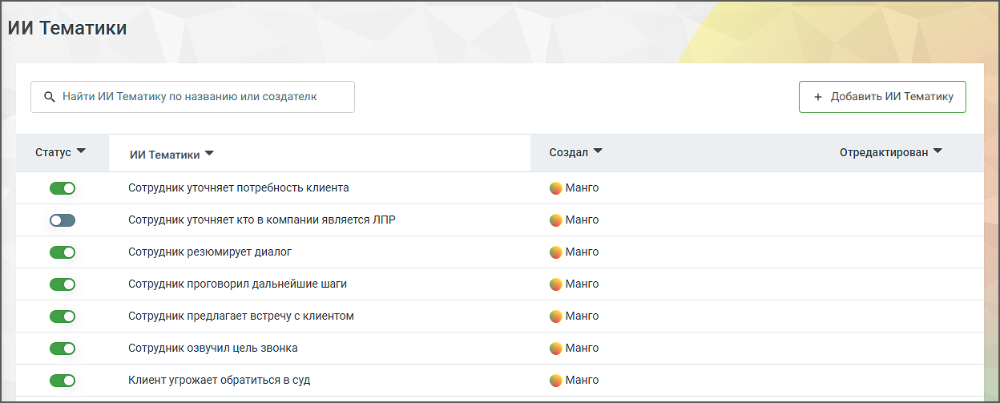

# 6.8. ИИ Тематики

> Трассировка: PDF §6.8 · сквозные стр. 59-62 · источники: ч.1 `kb/mango-product-docs/sources/speech-analytics/RECHEVAYA-ANALITIKA_VATS-_-Skoring-1.26.18.pdf` с.59-62.

Модуль Речевая аналитика поддерживает семантический анализ разговоров на основе запросов к ИИ, что делает возможным анализ диалогов без необходимости подбора ключевых слов. Модуль содержит 15 предустановленных ИИ тематик с использованием искусственного интеллекта, которые дают возможность отфильтровать диалоги. Речевая аналитика. ВАТС & Офлайн скоринг | v.1.26.18 59

| 8 800 555 55 22, mango-office.ru |  |
| --- | --- |
|  | mango@mangotele.com |

Для фильтрации диалога по тематике следует установить переключатель соответствующего запроса в положение “включено”. Клик по кнопке “Добавить ИИ Тематику” открывает окно добавления новой тематики. Ознакомьтесь с информацией в открывшемся окне и выберите подходящий вариант создания.

В этом окне сразу отображается несколько доступных шаблонов. Также доступно поле «Запрос к ИИ», в котором будет отображаться текст, соответствующий выбранному шаблону. При выборе шаблона содержимое поля запроса обновляется автоматически. При этом можно как переключаться между шаблонами, так и свободно редактировать текст запроса вручную. Однако Речевая аналитика. ВАТС & Офлайн скоринг | v.1.26.18 60

| 8 800 555 55 22, mango-office.ru |  |
| --- | --- |
|  | mango@mangotele.com |

при ручном редактировании текста в этом поле привязка к шаблону снимается, и тематика переходит в пользовательский режим. внимание Для работы ИИ Тематик необходимо, чтобы была подключена услуга распознавания разговоров и настроены сотрудники (и при необходимости направления звонков), разговоры которых отправляются на ИИ-анализ. Если сотрудники не настроены, ИИ Тематики не будут применяться к разговорам. При создании тематики с помощью ИИ важно формулировать ее четко и конкретно. Указывайте контекст или дополнительные условия, если они необходимы для правильного понимания тематики. Вопрос должен быть сформулирован таким образом, чтобы на него можно было ответить только "да" или "нет". Чем точнее будет вопрос-промт, тем более конкретный и полезный результат вы получите. После сохранения ИИ Тематика будет автоматически активирована. Система начнет тегировать звонки согласно тематике. Ограничения: • Лимит символов: Текст тематики может содержать не более 400 символов. Название - до 64 символов. Поддерживаются символы: А-я, A-z, ёЁ, пробелы, знаки пунктуации (/, - . ?). • Лимит: Вы можете создать не более 500 ИИ тематик. • Лимит активных ИИ тематик: Если в системе уже активировано 20 ИИ тематик, новая ИИ тематика будет добавлена в выключенном состоянии. После сохранения ИИ тематики пользователь имеет возможность отредактировать ее или удалить. Для удаления ИИ тематики необходимо подтверждение действия. Речевая аналитика. ВАТС & Офлайн скоринг | v.1.26.18 61

| 8 800 555 55 22, mango-office.ru |  |
| --- | --- |
|  | mango@mangotele.com |
