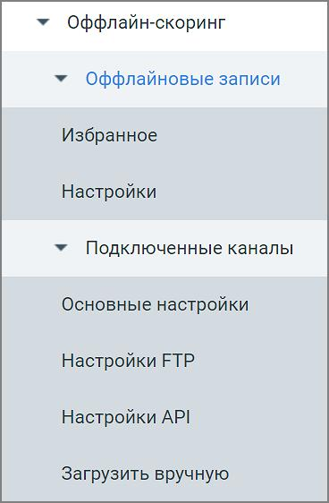

# 7. Офлайн-скоринг

> Трассировка: PDF §7 · сквозные стр. 62 · источники: ч.1 `kb/mango-product-docs/sources/speech-analytics/RECHEVAYA-ANALITIKA_VATS-_-Skoring-1.26.18.pdf` с.62.

| Есть возможность использовать сервис Речевой аналитики, работающий на звуковых |
| --- |
| записях/метаданных, поступающих из офлайновых источников. В качестве таковых могут |
| выступать п |

FTP/FTPS серверы используются в тех случаях, когда записанные звуковые данные собраны заранее, либо принимаются с устройств, не поддерживающих API.

