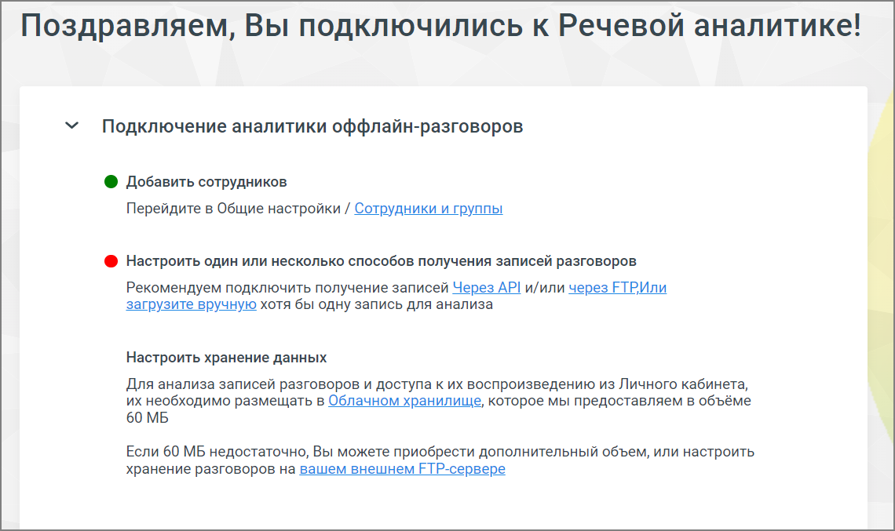

# 7.2.1. Основные настройки

> Трассировка: PDF §7.2.1 · сквозные стр. 65-66 · источники: ч.1 `kb/mango-product-docs/sources/speech-analytics/RECHEVAYA-ANALITIKA_VATS-_-Skoring-1.26.18.pdf` с.65-66.

Вкладка содержит описание опций, необходимых для корректной работы Речевой аналитики офлайн-разговоров со ссылками на соответствующие разделы.

По мере настройки опции изменяется ее индикатор:

опция не настроена

опция настроена Речевая аналитика. ВАТС & Офлайн скоринг | v.1.26.18 65

| 8 800 555 55 22, mango-office.ru |  |
| --- | --- |
|  | mango@mangotele.com |
