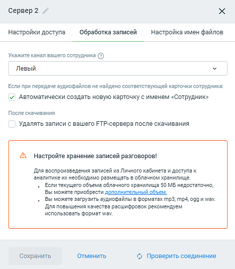

# 7.2.2. Настройки FTP

> Трассировка: PDF §7.2.2 · сквозные стр. 66-69 · источники: ч.1 `kb/mango-product-docs/sources/speech-analytics/RECHEVAYA-ANALITIKA_VATS-_-Skoring-1.26.18.pdf` с.66-69.

FTP/FTPS/SFTP серверы используются в тех случаях, когда записанные звуковые данные собраны заранее, либо принимаются с устройств, не поддерживающих API. Вкладка «Настройки FTP» содержит таблицу со списком настроенных доступов к внешним FTP/FTPS/SFTP-серверам. Доступ к вкладке имеют пользователи, в роли которых имеется разрешение «Загружать аудиофайлы через Web-интерфейс и настраивать их получение с FTP-сервера (для речевой аналитики записей офлайновых разговоров)».

Элементы таблицы: Название сервера – наименование внешнего FTP-сервера; URL – адрес сервера; Дата создания – дата добавления сервера на вкладку доступных FTP-серверов; Дата изменения – дата внесения изменений в настройки сервера; Статус – состояние FTP-сервера: • красный – если последняя попытка соединиться с сервером была неуспешной • зеленый – если последняя попытка соединиться с сервером была успешной Клик по кнопке «Добавить FTP/FTPS/SFTP» открывает форму добавления внешнего сервера. Речевая аналитика. ВАТС & Офлайн скоринг | v.1.26.18 66

| 8 800 555 55 22, mango-office.ru |  |
| --- | --- |
|  | mango@mangotele.com |

Вкладка «Настройки доступа»

Вкладка содержит следующие поля: 1) Протокол передачи – варианты: FTP, FTPS, SFTP; 2) Тип авторизации – варианты: пароль (для FTP, FTPS), пароль и ключ (для SFTP); 3) URL сервера – поле добавления адреса сервера. 4) Пользователь, указанный на сервере; 5) Ключ – при выборе типа авторизации «ключ» здесь необходимо загрузить файл-ключ доступа к серверу. На данный момент поддерживаются форматы ключей PEM, PuTTY v1 и v2. При других типах авторизации необходимо заполнять поля стандартной пары «логин-пароль». 6) Секретный код входа на сервер; 7) Порт – порт для входа на сервер. По умолчанию для ftp – 21, для ftps, sftp – 22; 8) Путь к файлам заданного пользователя на сервере; Речевая аналитика. ВАТС & Офлайн скоринг | v.1.26.18 67

| 8 800 555 55 22, mango-office.ru |  |
| --- | --- |
|  | mango@mangotele.com |

9) Периодичность проверки – выпадающий список с вариантами частоты проверки наличия новых записей на сервере; 10) Удалить соединение – клик по кнопке удаляет настроенное соединение с сервером; Кнопка «Проверить соединение» – клик по кнопке запускает процесс проверки соединения с сервером. От результата проверки зависит статус сервера. Вкладка «Обработка записей»

Вкладка содержит следующие поля: 1) Укажите канал вашего сотрудника – варианты: левый, правый. В рамках одного FTP- соединения канальность всех записей должна быть одинаковой для правильного анализа. Если некоторые из ваших записей имеют один канал, а другие два (т.е. содержат отдельно речь сотрудника и клиента), поместите их в разные папки FTP-сервера и настройте к ним отдельные доступы 2) Автоматически создавать новую карточку с именем «Сотрудник» – в случае, если система не нашла пару из каталога при загрузке записей, эта настройка позволяет записывать в отчетность данные о втором участнике разговора (клиенте), идентифицировать разговор с Речевая аналитика. ВАТС & Офлайн скоринг | v.1.26.18 68

| 8 800 555 55 22, mango-office.ru |  |
| --- | --- |
|  | mango@mangotele.com |

конкретным клиентом, а также вернуться к разбору проблемы с клиентом при необходимости. 3) Чекбокс «Удалять записи с вашего FTP-сервера после скачивания» – Если чекбокс включен, скачанные записи будут удаляться. По умолчанию включен (записи удаляются). Если чекбокс выключен, после успешного получения файла с сервера, файлы сохраняются в одной из двух создаваемых папок: «успешные» или «с ошибками». Вкладка «Настройка имен файлов» Вкладка содержит информационное сообщение о правилах настройки файловых имен для корректного распознавания записей. Заполните поля вкладок и сохраните внесенные изменения нажатием кнопки Сохранить. Клик по кнопке Отменить отменяет внесенные изменения.
