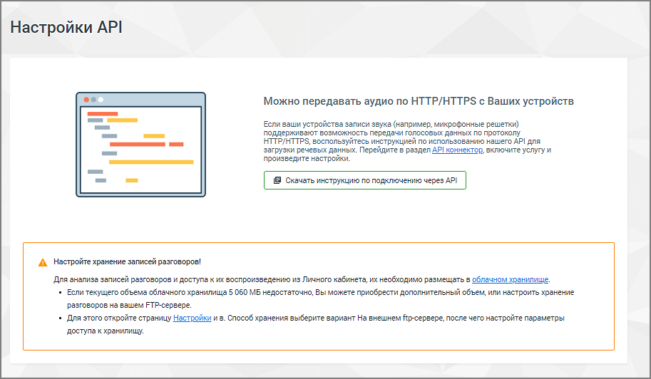

# 7.2.3. Настройки API

> Трассировка: PDF §7.2.3 · сквозные стр. 69-70 · источники: ч.1 `kb/mango-product-docs/sources/speech-analytics/RECHEVAYA-ANALITIKA_VATS-_-Skoring-1.26.18.pdf` с.69-70.

Сервис загрузки по HTTP записей, полученных из офлайн-источников. Основное применение сервиса: получение аудиоданных из мобильного приложения, в котором производится запись звука.

Данное API предназначено для:

| 1) Получения записей с приложения MANGO Talker (где предусмотрена встроенная поддержка |
| --- |
| данного API) |
| 2) Получения записей с произвольных клиентских устройств, поддерживающих передачу данных |
| по HTTP (через отправку POST-запросов) |

Речевая аналитика. ВАТС & Офлайн скоринг | v.1.26.18 69

| 8 800 555 55 22, mango-office.ru |  |
| --- | --- |
|  | mango@mangotele.com |

| Каждый аудиофайл передается сразу после формирования. Если запись продолжается |
| --- |
| длительное время, клиентское устройство/ПО может для оперативности передачи автоматически |
| разрезаться на фрагменты, не превышающие заданной длины (по умолчанию 5 минут). |
| Вместе с записью передаются следующие данные: |

| • Кто записывал (системный ID пользователя). |
| --- |
| • ID устройства (используется в случае, если для передачи данных используется не |
| мобильное приложение, а конечное устройство, где нет возможности указать учетную запись |
| сотрудника). |
| • Дата/время начала записи. |
| • Количество каналов записи (1 или 2). |
