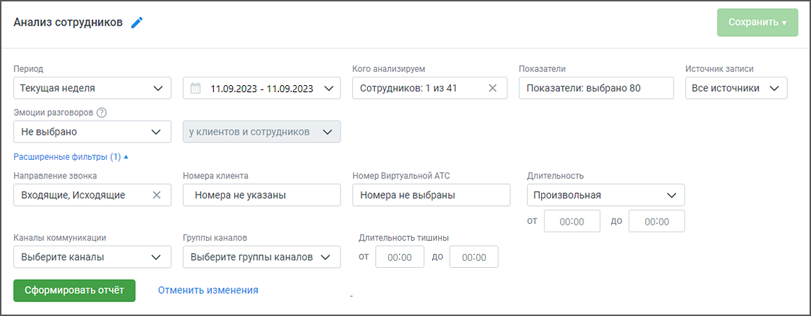
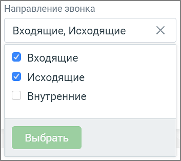
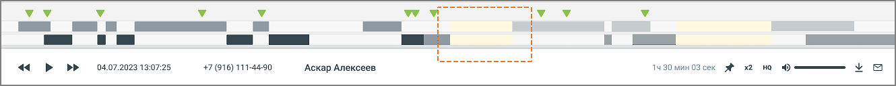

# 9.2.1. Блок фильтров

> Трассировка: PDF §9.2.1 · сквозные стр. 80-82 · источники: ч.1 `kb/mango-product-docs/sources/speech-analytics/RECHEVAYA-ANALITIKA_VATS-_-Skoring-1.26.18.pdf` с.80-82.

Кнопка Сохранить – сохранение отчета на странице Мои отчеты; Кнопка Удалить – удаление отчета со страницы Мои отчеты; Пиктограмма «карандаш» – переименование отчета.

При формировании отчета пользователям доступна фильтрация: Период – произвольный, текущий день, текущая неделя, текущий месяц, с прошлого месяца, с позапрошлого месяца, текущий год, весь период. Кого анализируем – в выпадающем списке фильтра есть два уровня: сначала отображаются группы, а внутри них — сотрудники. Пользователь может выбрать нужную группу, чтобы сразу увидеть всех её участников, или найти конкретного человека. Если ни один сотрудник не выбран, отчет формируется по всем сотрудникам. Показатели – все тематики (в том числе неактивные), а также характеристики разговора. Подробнее здесь. Источник записи – выбор типа записи разговора: телефонные разговоры/ офлайн-записи /текстовые коммуникации. Эмоции разговоров (по клиентам, по сотрудникам, по клиентам и сотрудникам) – дополнительная настройка для фильтрации разговоров в зависимости от выбранной эмоции: негативно, позитивно, нейтрально. В таблице отчета отображаются соответствующими пиктограммами-смайликами. Эмоции определяются на основании звуков (тембра, громкости). При выборе типа записи разговора «текстовые коммуникации» фильтр недоступен. Направление – входящий, исходящий, внутренний звонок или текстовое сообщение. Номер ВАТС – выбор номеров линии ВАТС (максимальное количество – 100). При выборе типа записи разговора «текстовые коммуникации» или «офлайн-записи» фильтр недоступен. Речевая аналитика. ВАТС & Офлайн скоринг | v.1.26.18 80

| 8 800 555 55 22, mango-office.ru |  |
| --- | --- |
|  | mango@mangotele.com |

Номер клиента – выбор произвольного номера клиента. При выборе типа записи разговора «текстовые коммуникации» фильтр недоступен. Длительность звонка – по умолчанию установлена произвольная длительность звонка. При выборе типа записи разговора «текстовые коммуникации» фильтр недоступен.

Каналы коммуникации – выбор из выпадающего списка доступных в разделе «Диалоги» ЛК ВАТС каналов коммуникации. Варианты: Чат на сайте, ВКонтакте, Viber, Telegram, WhatsApp, Avito. При выборе типа записи разговора «офлайн-записи» или «телефонные разговоры» фильтр недоступен. Группы каналов – выбор из выпадающего списка созданных в разделе «Диалоги» ЛК ВАТС групп каналов коммуникации. При выборе типа записи разговора «офлайн-записи» или «телефонные разговоры» фильтр недоступен. Каналы коммуникации будут отображаться только в том случае, если соответствующая услуга была ранее подключена. Внутри фильтра действует принцип фильтрации – ИЛИ (когда одно из условий истинно). Между фильтрами действует принцип фильтрации – И (когда все условия истинны).

ПРИМЕР 1 В фильтре Направление (внутри фильтра) выбраны: Входящие, Исходящие. При поиске по заданным условиям в отчете будут представлены разговоры, когда хотя бы одно из условий истинно – т. е. или входящие, или исходящие вызовы или текстовые сообщения. ПРИМЕР 2 В фильтре Источник записи выбраны: Телефонные разговоры. В фильтре Направление выбраны: Входящие. В фильтре Длительность выбрано «Меньше 1 мин.». При поиске по заданным условиям в отчете будут представлены разговоры, когда все три условия истинны – т. е. входящие телефонные вызовы длительностью менее 1 минуты.

Длительность тишины – используя этот фильтр руководитель может контролировать сотрудников на предмет тишины в разговорах, для выявления слабых мест в работе операторов. Фильтр применим только к новым записям. Речевая аналитика. ВАТС & Офлайн скоринг | v.1.26.18 81

| 8 800 555 55 22, mango-office.ru |  |
| --- | --- |
|  | mango@mangotele.com |

| • Если не выбрана величина "от" – отфильтруются все разговоры, где длительность тишины |
| --- |
| была до указанного времени. |
| • Если не выбрала величина "до" – отфильтруются разговоры, где длительность тишины была |
| более указанного времени. |
| Длительность тишины также отображается на плеере расшифровки разговора. |

Изменение какого-либо из дополнительных фильтров не приводит к автоматическому обновлению данных в отчете. Для обновления данных нажмите кнопку «Сформировать отчет».
