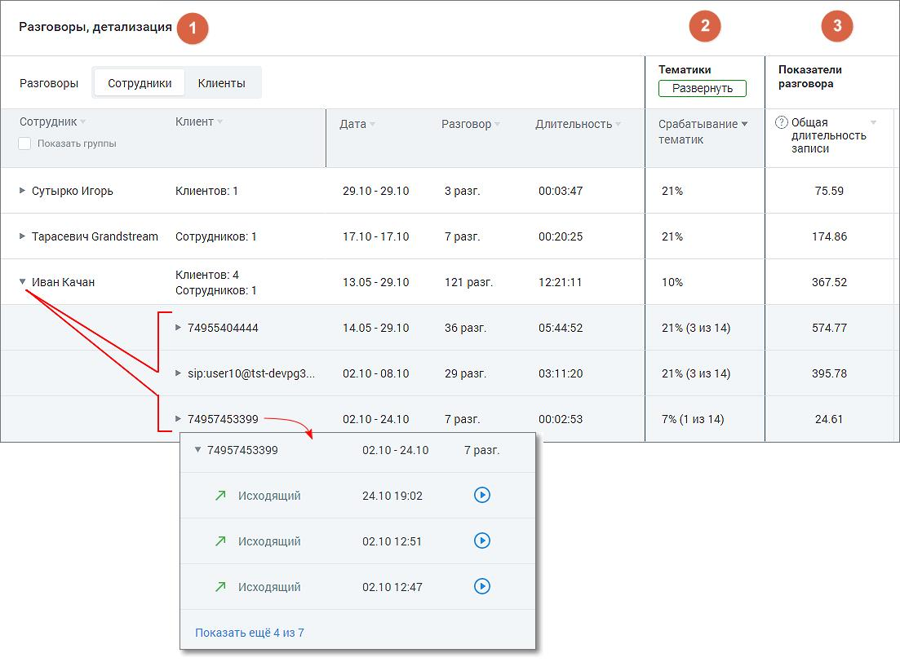
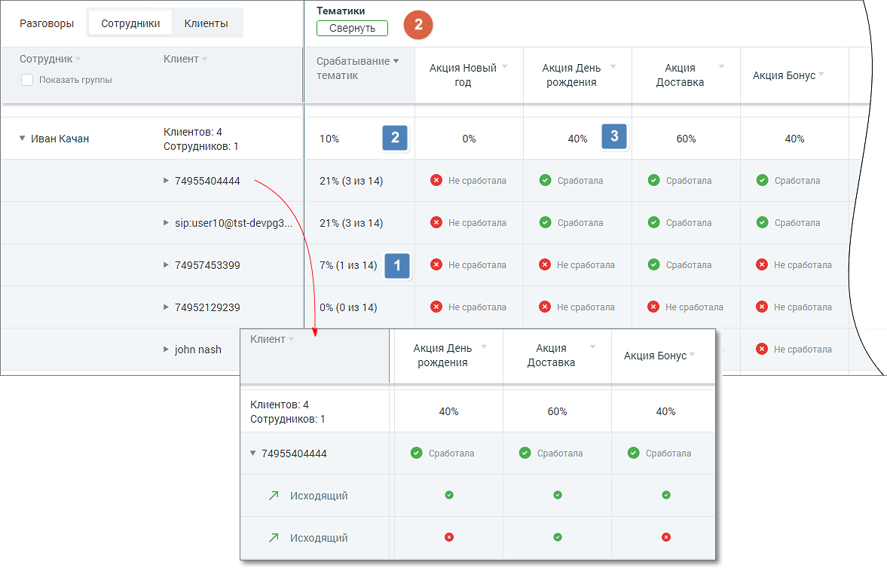

# 9.2.3. Блок таблицы Разговоры, детализация

> Трассировка: PDF §9.2.3 · сквозные стр. 83-87 · источники: ч.1 `kb/mango-product-docs/sources/speech-analytics/RECHEVAYA-ANALITIKA_VATS-_-Skoring-1.26.18.pdf` с.83-87.

Табличная часть отчета состоит из трех разделов: Речевая аналитика. ВАТС & Офлайн скоринг | v.1.26.18 83

| 8 800 555 55 22, mango-office.ru |  |
| --- | --- |
|  | mango@mangotele.com |

• Разговоры • Тематики • Показатели разговора Для типа записи разговора «Текстовые коммуникации» в качестве показателей отображаются только данные разговоров по тематикам. 1. Раздел «Разговоры, детализация» Детализация разговоров предоставляется в срезах Сотрудники/Клиенты. В таблице отчета данные выводятся с возможностью группировки согласно установленных фильтров. Рассмотрим пример построения таблицы для типа записи разговора: «телефонные разговоры»:

Таблица содержит следующие столбцы (рассмотрим пример для среза «Сотрудники»): • Сотрудник – имя сотрудника ВАТС. • Клиент – количество уникальных внешних номеров (не привязанных ни к одному из сотрудников ВАТС) с которыми у выбранного сотрудника за выбранный период состоялся разговор. Если в качестве источника записи выбран тип разговора «телефонные разговоры», то в списке содержится информация о наименовании группы каналов и канале коммуникации разговора. По каждому пункту списка доступна детализация звонков с записями разговоров, а также текста диалога в канале коммуникации (если на ВАТС подключены соответствующие услуги). • Дата – диапазон дат в которые у выбранного сотрудника имеются распознанные разговоры. Речевая аналитика. ВАТС & Офлайн скоринг | v.1.26.18 84

| 8 800 555 55 22, mango-office.ru |  |
| --- | --- |
|  | mango@mangotele.com |

• Разговор – суммарное количество распознанных разговоров выбранного сотрудника за выбранный период. • Длительность – суммарная длительность всех распознанных разговоров выбранного сотрудника за выбранный период в формате ЧЧ:ММ:СС. • Эмоции клиента – среднее значение, отображается смайлом. • Эмоции сотрудника – среднее значение, отображается смайлом.

По клику на пиктограмму аудиозаписи или текстового канала коммуникации (например ) открывает открывается детализация записи разговора или текстового диалога. Если чекбокс «Показать группы» проставлен, столбец Сотрудник содержит двухуровневый иерархический список (группа / сотрудник): т.е. сотрудники сгруппированы по группам. Данные в отчете в этом случае формируются и для группы в целом. 2. Раздел «Тематики» Рассмотрим пример построения таблицы для типа записи разговора: «телефонные разговоры».

В развернутом виде раздел таблицы содержит следующие столбцы: • Срабатывание тематик– показатель вида (N из M), где N – количество соответствующих данному разговору тематик, а M – общее количество тематик, выбранных в блоке фильтрации. • Столбцы с наименованиями тематик – все тематики, выбранные в блоке фильтрации, с пометкой о срабатывании. В детализации звонков пометка о срабатывании отображается по каждому звонку. При расчете данных в столбцах используются следующие величины: N – количество соответствующих разговору тематик M – общее количество тематик, выбранных в блоке фильтрации Речевая аналитика. ВАТС & Офлайн скоринг | v.1.26.18 85

| 8 800 555 55 22, mango-office.ru |  |
| --- | --- |
|  | mango@mangotele.com |

– параметр, равный N/M*100%;

– параметр, равный среднему арифметическому данных в строке по всем выбранным тематиким;

– параметр, равный отношению количества меток "Сработал" (по вертикали) к общему количеству меток ("Сработал " + "Не сработал ") 3. Раздел «Показатели разговора» Рассмотрим пример построения таблицы для типа записи разговора «телефонные разговоры»:

Раздел таблицы содержит следующие столбцы: • Общая длительность аудиозаписи • Длительность разговора • Длительность обоюдного молчания • Доля разговора • Доля обоюдного молчания • Количество перебиваний сотрудником • Количество перебиваний клиентом • Доля обоюдного разговора • Доля разговора сотрудника Речевая аналитика. ВАТС & Офлайн скоринг | v.1.26.18 86

| 8 800 555 55 22, mango-office.ru |  |
| --- | --- |
|  | mango@mangotele.com |

• Доля разговора клиента • Скорость разговора сотрудника • Скорость разговора клиента Чтобы узнать правило расчета каждого из показателей, наведите курсор на пиктограмму «?» возле наименования показателя. Подробнее о значениях показателей узнайте здесь. Для фильтрации данных отчета по возрастанию/убыванию следует щелкнуть по наименованию столбца.

Для выгрузки данных отчета в формате CSV кликните на пиктограмму в правом верхнем углу табличной части. Доступны выгрузка файла отчета по сотрудникам и по клиентам.
