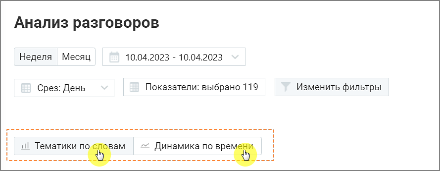

# 9.3. Анализ разговоров

> Трассировка: PDF §9.3 · сквозные стр. 88-89 · источники: ч.1 `kb/mango-product-docs/sources/speech-analytics/RECHEVAYA-ANALITIKA_VATS-_-Skoring-1.26.18.pdf` с.88-89.

Отчет «Анализ разговоров» состоит из двух блоков: Блока таблицы и Блока визуализаций Тематики по словам и Динамика по времени. Блоки визуализаций отображаются по щелчку на соответствующей вкладке:

Речевая аналитика. ВАТС & Офлайн скоринг | v.1.26.18 88

| 8 800 555 55 22, mango-office.ru |  |
| --- | --- |
|  | mango@mangotele.com |
