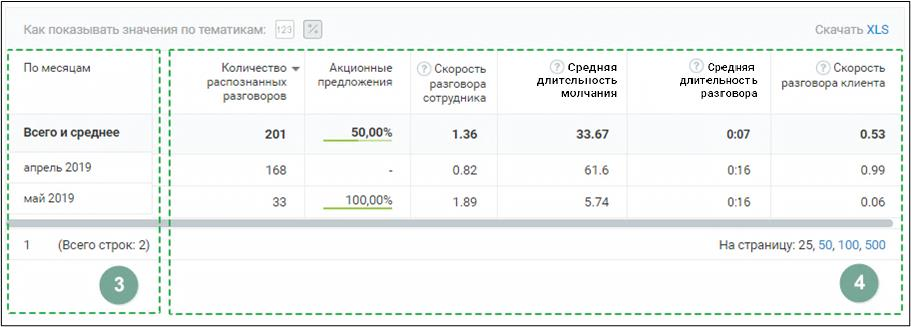

# 9.3.3. Блок таблицы

> Трассировка: PDF §9.3.3 · сквозные стр. 92-93 · источники: ч.1 `kb/mango-product-docs/sources/speech-analytics/RECHEVAYA-ANALITIKA_VATS-_-Skoring-1.26.18.pdf` с.92-93.

Таблица формируется по срезу День/Месяц/Год и заданным пользователем в окне “Показатели” параметрам. Для типа записи разговора «Текстовые коммуникации» в качестве показателей отображаются только данные разговоров по тематикам. Таблица может включать следующие данные:

Срез: день, месяц или год. Этот показатель присутствует в таблице всегда.

Показатели: • название тематики – в примере на скриншоте выбрана тематика «Акционные предложения». При выборе для отчета большего количества тематик, данные по каждой из них будут отображаться в отдельном столбце. Где заголовок – название выбранной тематики. Речевая аналитика. ВАТС & Офлайн скоринг | v.1.26.18 92

| 8 800 555 55 22, mango-office.ru |  |
| --- | --- |
|  | mango@mangotele.com |

ВАЖНО: Данные столбца могут отображаться в двух вариантах: - в виде процентного соотношения разговоров в срезе, отнесенных к данной тематике, к общему числу разговоров в срезе; - в числовом виде – количество разговоров в срезе, отнесенных к данной тематике; • Количество распознанных разговоров. Этот показатель присутствует в таблице всегда • Средняя длительность записи • Средняя длительность разговора • Средняя длительность молчания • Доля разговора • Доля обоюдного молчания • Количество перебиваний сотрудником • Количество перебиваний клиентом • Доля обоюдного разговора • Доля разговора сотрудника • Доля разговора клиента • Скорость разговора сотрудника • Скорость разговора клиента

Чтобы узнать правило расчета каждого из показателей, наведите курсор на пиктограмму возле наименования показателя. Для фильтрации данных отчета по возрастанию/убыванию следует щелкнуть по наименованию столбца.
