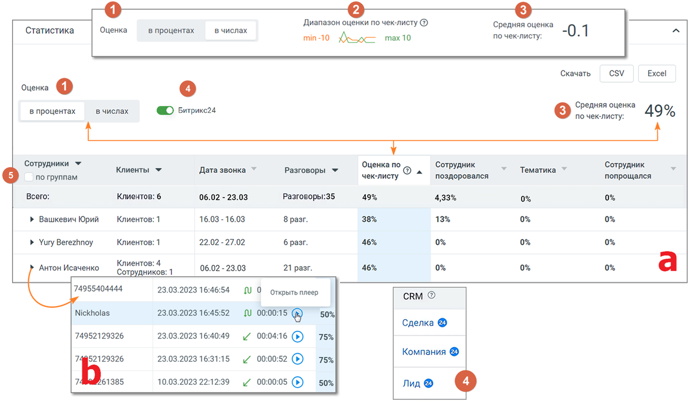
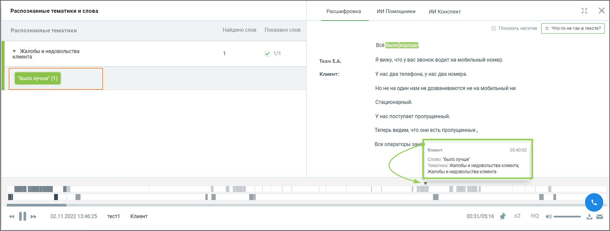
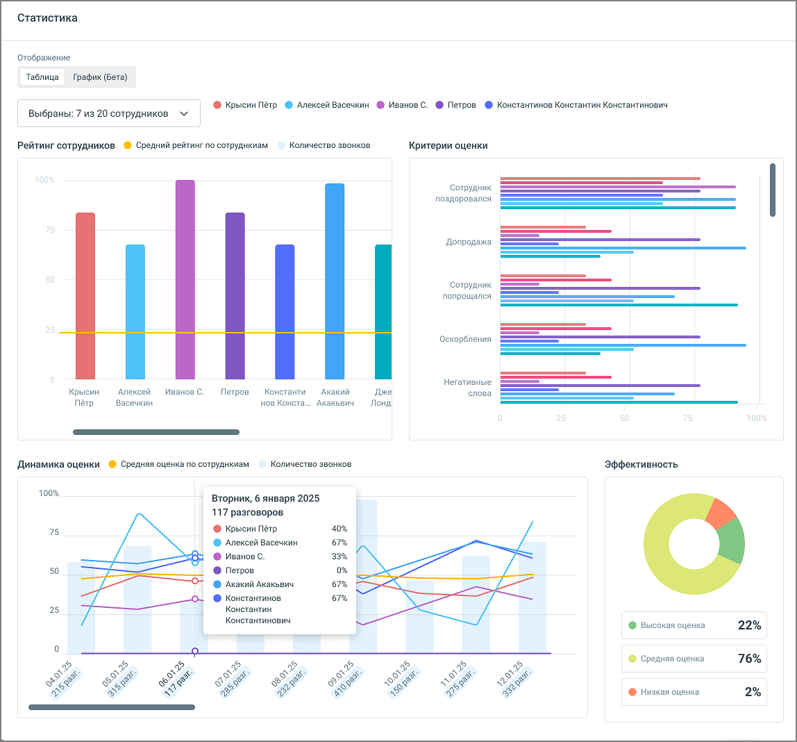

# 9.4.2. Статистика

> Трассировка: PDF §9.4.2 · сквозные стр. 102-105 · источники: ч.1 `kb/mango-product-docs/sources/speech-analytics/RECHEVAYA-ANALITIKA_VATS-_-Skoring-1.26.18.pdf` с.102-105.

| Статистика отчета по Чек-листам содержит вкладки «Таблица» и «График», которые позволяют |
| --- |
| комплексно анализировать результаты оценок в отчете. |

Вкладка «Таблица» Статистика по чек-листу отображается в процентах и числах и показывает результаты просчета чек-листа по заданным в блоке «Критерии» чек-листа критериям и фильтрам.

Элементы окна статистики: 1) Заголовок окна 1. Выбор отображения данных: Оценка в процентах или числах. По умолчанию установлен вариант «в процентах». Если в окне статистики пользователь выбирает вариант «в числах», то в списке чек- листов средняя оценка по чек-листу также будет отображаться в числах. 2. Виджет "Диапазон оценки по чек-листу" – максимальные и минимальные оценки, которые можно получить по данному чек-листу. В отчете отображается если выбрана оценка «в числах». 3. Средняя оценка по чек-листу – отображается в процентах или в числах, в зависимости от выбора отображения данных. Речевая аналитика. ВАТС & Офлайн скоринг | v.1.26.18 102

| 8 800 555 55 22, mango-office.ru |  |
| --- | --- |
|  | mango@mangotele.com |

4. Переключатель "Битрикс24" – в таблице статистики звонков переключатель добавляет возможность быстрого перехода к данным CRM из соответствующей строки записи. Для каждого звонка, связанного с CRM, отображается название сущности (лид, сделка или компания) которое служит активной ссылкой. При клике на ссылку открывается страница сущности в Битрикс24. 5. Чекбокс группировки сотрудников по группам – в таблице статистики имеется возможность группировки сотрудников по заранее определённым группам. Если чекбокс отмечен: • Статистика отображается для групп, а не для отдельных сотрудников. • На уровне каждой группы отображаются агрегированные данные — средние значения или суммы, в зависимости от показателя (например, средняя оценка, общее количество разговоров и т.п.). внимание Включение функции возможно только если подключена интеграция с Bitrix24 (расширенный пакет), а также настроена передача данных в Речевую аналитику. Подробнее о подключении узнайте здесь. 2) Таблица (a) с блоком детализации (b) • Сотрудники (с чекбоксом "по группам") .– имя сотрудника или название группы, которых анализируем; • Клиенты – количество клиентов. В детализации номер телефона или имя клиента; • Дата звонка – диапазон дат, в которые совершались звонки. В детализации – дата и время конкретного звонка; • Разговоры – количество разговоров. В детализации – длительность и тип разговора (пиктограмма со стрелкой: входящий, исходящий, внутренний); • Оценка по чек-листу – усредненная оценка по чек-листу по всем разговорам. В детализации – точная оценка по чек-листу каждого разговора. Отображается в зависимости от выбора отображения в процентах или числах; • Настраиваемые показатели – соответствуют названиям критериев, которые выбраны в Конструкторе при создании чек-листа. Отображаются в зависимости от выбора отображения в процентах или числах;

Клик по пиктограмме открывает окно встроенного плеера для прослушивания разговора со следующей информацией: • Тематики и ключевые слова – список распознанных ключевых слов, сгруппированный по тематикам. • Расшифровка текста разговора – помимо текста разговора включает данные сотрудника и клиента, а также метки вхождений. Для внутренних разговоров – данные обоих сотрудников.

• Плеер с отметками фрагментов разговора и вхождений терм .

Речевая аналитика. ВАТС & Офлайн скоринг | v.1.26.18 103

| 8 800 555 55 22, mango-office.ru |  |
| --- | --- |
|  | mango@mangotele.com |

3) Кнопки «Сохранить», «Вернуться к списку» • Клик по кнопке «Вернуться к списку» открывает страницу списка чек-листов. • Клик по кнопке «Сохранить» сохраняет внесенные в чек-лист изменения. Если изменения не вносились, кнопка не активна. 4) Кнопки экспорта Файл статистики может быть экспортирован в форматах Csv, Excel. Для экспорта нажмите кнопку соответствующего формата рядом с подсказкой «Скачать». Речевая аналитика. ВАТС & Офлайн скоринг | v.1.26.18 104

| 8 800 555 55 22, mango-office.ru |  |
| --- | --- |
|  | mango@mangotele.com |

График

Вкладка "График" содержит следующие элементы: • Рейтинг сотрудников: Бары отображают сравнительный рейтинг выбранных в чек-листе сотрудников. • Критерии оценки: Горизонтальные линейные графики показывают распределение различных оценочных критериев применительно к сотруднику. • Динамика оценки: Линейные графики для анализа изменений оценок каждого из сотрудников во времени. • Эфективность: Круговая диаграмма для визуализации процентного распределения оценок по сотрудникам.
