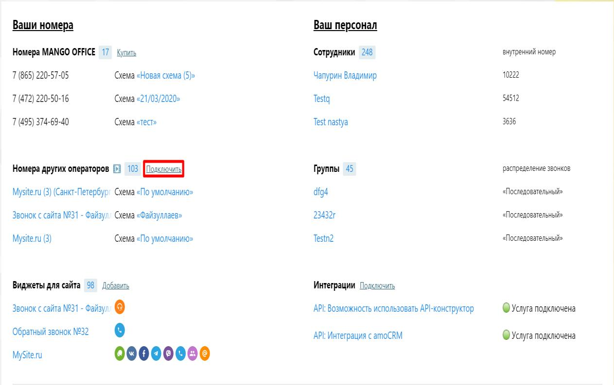
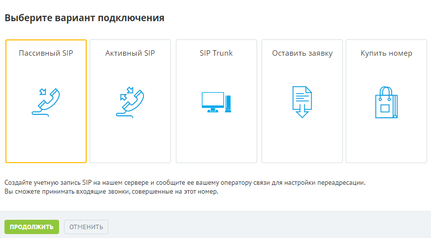
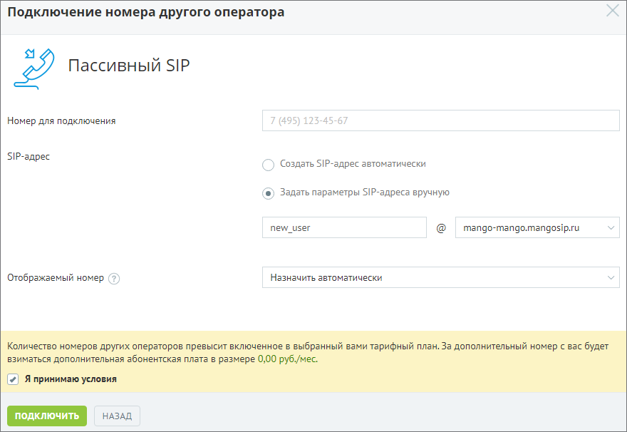
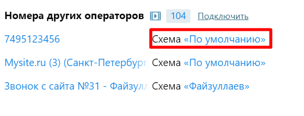
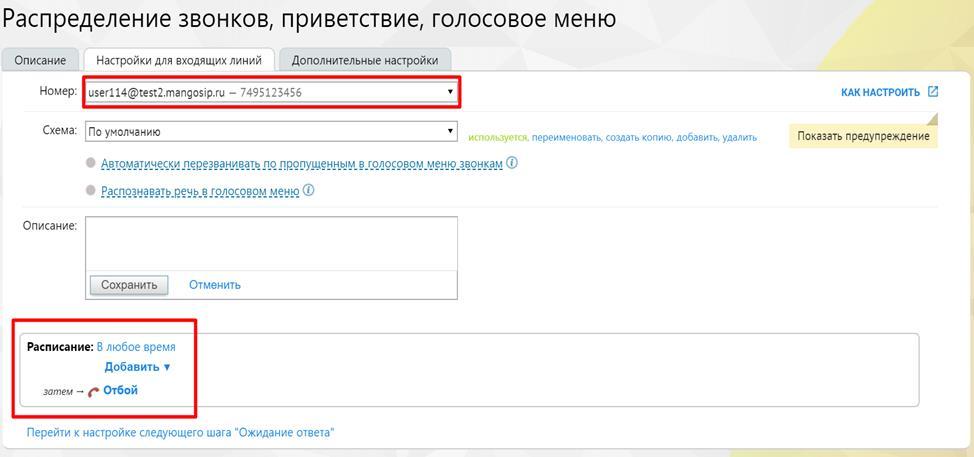

# 11.1.1. Подключение пассивного SIP

> Трассировка: PDF §11.1.1 · сквозные стр. 121-124 · источники: ч.1 `kb/mango-product-docs/sources/speech-analytics/RECHEVAYA-ANALITIKA_VATS-_-Skoring-1.26.18.pdf` с.121-124.

Шаг 1. Включаем услугу На обзорной панели Личного кабинета в блоке "Номера других операторов" нажимаем кнопку "Подключить". Речевая аналитика. ВАТС & Офлайн скоринг | v.1.26.18 121

| 8 800 555 55 22, mango-office.ru |  |
| --- | --- |
|  | mango@mangotele.com |

Шаг 2. Продолжаем настройку В открывшемся меню выбираем пункт "Пассивный SIP" и нажимаем кнопку "Продолжить".

Шаг 3. Вносим данные для настройки Номер для подключения – номер телефона стороннего оператора, который требуется подключить; SIP-адрес – ручной режим необходим в тех случаях, когда Ваш системный администратор хочет видеть в трафике «читабельный» SIP-адрес. В автоматическом режиме SIP-адрес выглядит как набор символов; Речевая аналитика. ВАТС & Офлайн скоринг | v.1.26.18 122

| 8 800 555 55 22, mango-office.ru |  |
| --- | --- |
|  | mango@mangotele.com |

Отображаемый номер – линия ВАТС MANGO OFFICE, которая будет использоваться в качестве переадресации. При входящем звонке на телефоне отобразится этот номер. Транслировать номер звонящего в данном варианте нельзя. Шаг 4. Прописываем SIP-адрес для Пассивного SIP В поле "SIP-адрес" появилось еще одно окно для заполнения SIP-адреса. Адрес можно прописывать согласно данным провайдера, либо придумать самостоятельно.

Далее следует принять условия и нажать кнопку "Подключить". Шаг 5. Передача информации стороннему оператору Поздравляем! Вы создали SIP-адрес. Его необходимо сообщить оператору вашей ВАТС, чтобы все звонки с вашего номера направлялись на этот SIP-адрес. Или установить подключение самостоятельно, если в Личном кабинете ВАТС вашего оператора имеется соответствующая функция. Шаг 6. Настройка схемы переадресации. После успешной настройки Пассивного SIP необходимо задать переадресацию на ваших сотрудников. Для этого на обзорной панели Личного кабинета в блоке "Номера других операторов" находим номер, который мы указали в Шаге 3, и кликаем на схему. Речевая аналитика. ВАТС & Офлайн скоринг | v.1.26.18 123

| 8 800 555 55 22, mango-office.ru |  |
| --- | --- |
|  | mango@mangotele.com |

Шаг 7. Продолжаем настраивать схему переадресации с Пассивного SIP В поле "Номер" Вы увидите SIP-адрес, который мы прописали в шаге 5. Настраиваем схему переадресации. Теперь все звонки, которые поступают на номер стороннего оператора, будут распределяться на Ваших сотрудников.

