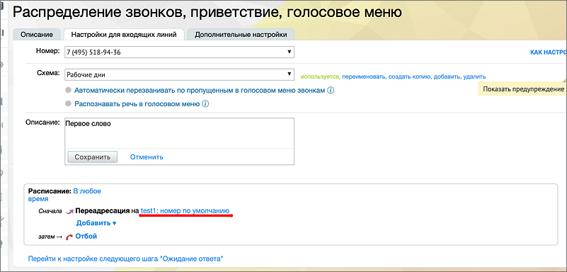

# 11.3.1. Настройка схемы распределения звонков в Личном кабинете

> Трассировка: PDF §11.3.1 · сквозные стр. 133 · источники: ч.1 `kb/mango-product-docs/sources/speech-analytics/RECHEVAYA-ANALITIKA_VATS-_-Skoring-1.26.18.pdf` с.133.

звонков в Личном кабинете После создания сотрудника настраиваем переадресацию на DID MANGO на сторонней ВАТС.

