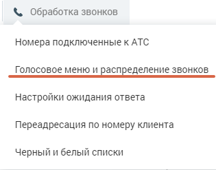
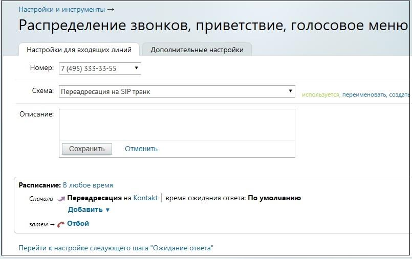

# 11.4.2. Настройка схемы распределения звонков в Личном кабинете

> Трассировка: PDF §11.4.2 · сквозные стр. 138-141 · источники: ч.1 `kb/mango-product-docs/sources/speech-analytics/RECHEVAYA-ANALITIKA_VATS-_-Skoring-1.26.18.pdf` с.138-141.

звонков в Личном кабинете Для настройки схемы распределения звонков откройте подраздел “Голосовое меню и распределение звонков” в разделе “Обработка звонков” в Личном кабинете пользователя ВАТС. Панель настройки содержит вкладки: • Настройки для входящих линий • Дополнительные настройки Выберите из списка телефонный̆ номер, подключённый̆ через SIP Trunk, для которого будет настраиваться схема. Далее действуйте согласно инструкции о создании схем переадресации. См. раздел «Обработка звонков» в Справочнике ВАТС. Речевая аналитика. ВАТС & Офлайн скоринг | v.1.26.18 138

| 8 800 555 55 22, mango-office.ru |  |
| --- | --- |
|  | mango@mangotele.com |

Для создания схемы, включающей̆ переадресацию звонков на SIP Trunk кликните по ссылке “не указано”.

В открывшейся форме выберите вкладку SIP Trunk. В выпадающем окне содержится список всех активных транков. При выборе транка в окне отображаются его параметры.

SIP Trunk настроен и может совершать входящие и исходящие звонки. Речевая аналитика. ВАТС & Офлайн скоринг | v.1.26.18 139

| 8 800 555 55 22, mango-office.ru |  |
| --- | --- |
|  | mango@mangotele.com |

Важно: интеграция по SIP Trunk не имеет привязки к сотруднику, таким образом аналитика по сотруднику не доступна. Функционал возможностей Речевой аналитики в этом случае будет ограничен. Речевая аналитика. ВАТС & Офлайн скоринг | v.1.26.18 140

| 8 800 555 55 22, mango-office.ru |  |
| --- | --- |
|  | mango@mangotele.com |
