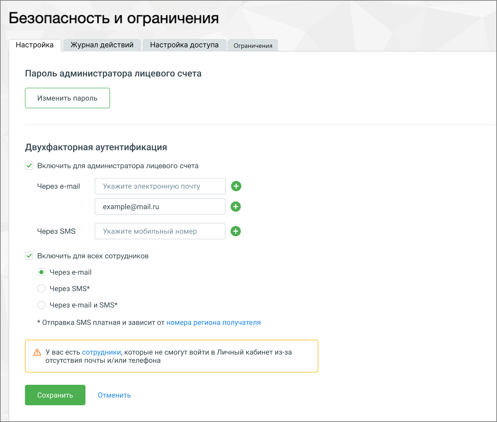
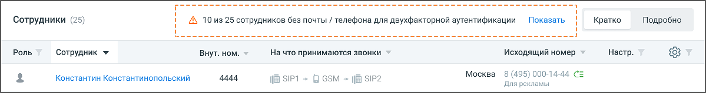
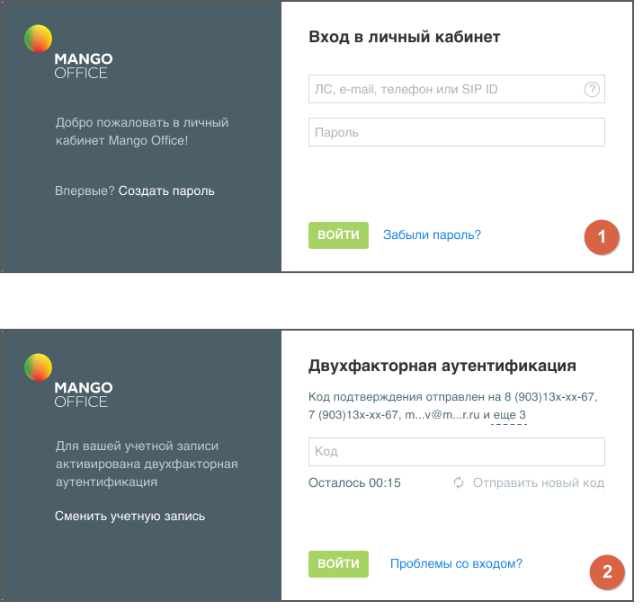

# 12. Подключение двухфакторной аутентификации

> Трассировка: PDF §12 · сквозные стр. 141-143 · источники: ч.1 `kb/mango-product-docs/sources/speech-analytics/RECHEVAYA-ANALITIKA_VATS-_-Skoring-1.26.18.pdf` с.141-143.

двухфакторной аутентификации В Личном кабинете можно подключить двухфакторную аутентификацию, что увеличивает безопасность аккаунта за счёт использования двух различных методов подтверждения личности.

Для активации двухфакторной аутентификации необходимо последовательно перейти в раздел Общие настройки → Безопасность и ограничения и выполнить следующие шаги: 1. Отметить чек-бокс "Включить для администратора личного кабинета", чтобы активировать функцию для вашего аккаунта. 2. Выбрать предпочтительный метод получения кода: • Через e-mail: Ввести адрес электронной почты • Через SMS: Ввести мобильный номер телефона

• Клик по пиктограмме добавляет дополнительные поля ввода данных. Речевая аналитика. ВАТС & Офлайн скоринг | v.1.26.18 141

| 8 800 555 55 22, mango-office.ru |  |
| --- | --- |
|  | mango@mangotele.com |

3. Также можно активировать двухфакторную аутентификацию для всех сотрудников организации. Для этого необходимо подключить соответствующую услугу. Отметьте чек- бокс «Включить для всех сотрудников» и выберите метод подтверждения: через e-mail, SMS или оба варианта. Если у некоторых сотрудников не указаны контактные данные для двухфакторной аутентификации, появится предупреждение. Необходимо убедиться, что у всех сотрудников введены эти данные, иначе они не смогут войти в Личный кабинет. На странице Сотрудники и группы следует обратить внимание на восклицательные знаки — они сигнализируют о сотрудниках, у которых отсутствует телефон и/или e-mail для двухфакторной аутентификации.

Используйте новую фильтрацию в столбце настроек для быстрого поиска сотрудников без указанных контактных данных. После ввода всех необходимых данных необходимо сохранить настройки кнопкой "Сохранить". внимание Отправка SMS может быть платной и зависеть от номера региона сотрудника.

Речевая аналитика. ВАТС & Офлайн скоринг | v.1.26.18 142

| 8 800 555 55 22, mango-office.ru |  |
| --- | --- |
|  | mango@mangotele.com |

Если в Личном кабинете включена двухфакторная аутентификация, чтобы авторизоваться в системе необходимо: • В окне (1) (см. рис. выше) ввести логин (ЛС, e-mail, телефон, SIP ID) и пароль. • Нажать кнопку "ВОЙТИ" для подтверждения идентификации. • В случае активированной двухфакторной аутентификации, откроется дополнительное окно (2). • На указанный при настройке выше телефон/email придет код подтверждения. • Ввести полученный код в соответствующее поле. • Обратить внимание на таймер, отсчитывающий время для ввода кода. • При необходимости использовать опцию "Отправить новый код" для повторной отправки. • Завершить вход, подтвердив введенный код, с помощью кнопки "ВОЙТИ". Речевая аналитика. ВАТС & Офлайн скоринг | v.1.26.18 143
