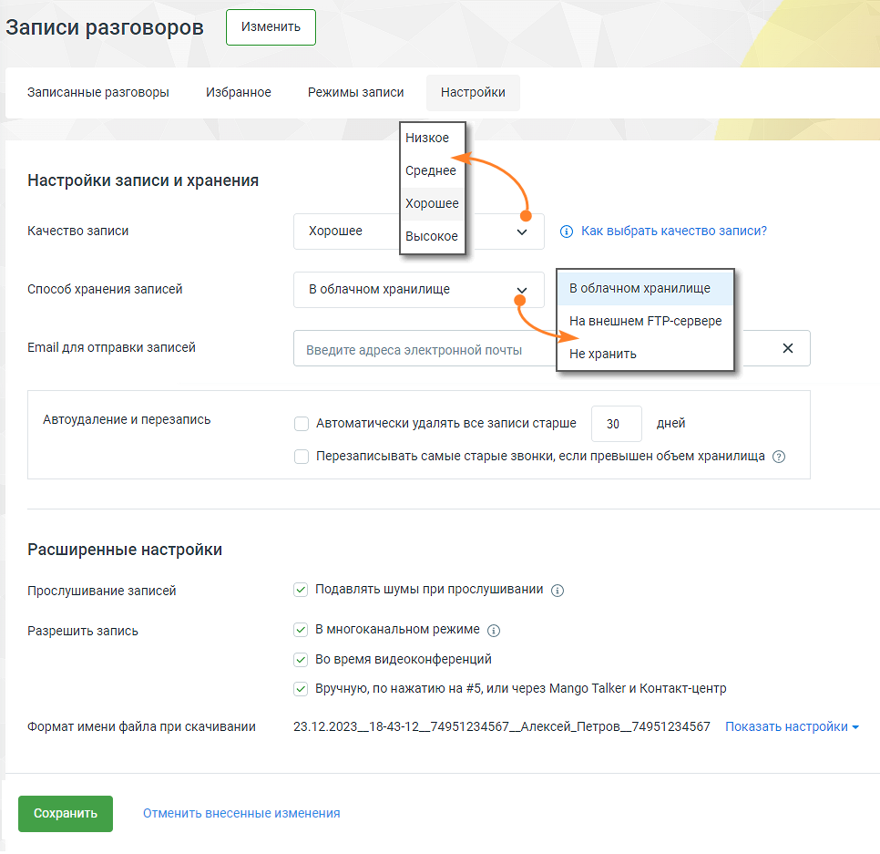

# 1. Общие сведения

> Трассировка: PDF §1 · сквозные стр. 4-7 · источники: ч.1 `kb/mango-product-docs/sources/speech-analytics/RECHEVAYA-ANALITIKA_1.26.18.pdf` с.4-7.

Речевая аналитика распознает записанные разговоры и текстовые сообщения, и производит в них поиск — вручную или автоматически — необходимой информации. Как работает поиск по распознанным записям разговоров, читайте здесь. Рабочая область раздела Речевая аналитика содержит следующие вкладки: Отчеты Тегирование разговоров Текстовые коммуникации Настройки ИИ Помощники Расходы Речевой аналитики После подключения Речевой аналитики пользователю доступны следующие функции: • Поиск в распознанных записях разговоров заданных слов и выражений • Текстовая расшифровка разговора • Автоматическое проставление тематики звонка • Аналитика текстовых коммуникаций • Составление отчетов • Получение уведомлений • Формирования чек-листов и получение статистики по чек-листам • Подача заявок на распознавание, для улучшения качества распознавания внимание Для распознавания Речевой аналитикой звонков необходимо подключить Запись разговоров. Речевая аналитика | v.1.26.18 4

| 8 800 555 55 22, mango-office.ru |  |
| --- | --- |
|  | mango@mangotele.com |

Речевая аналитика | v.1.26.18 5

| 8 800 555 55 22, mango-office.ru |  |
| --- | --- |
|  | mango@mangotele.com |

Если в настройках способа хранения записей разговоров пользователем выбран способ Не хранить, записи и расшифровки разговоров не сохраняются. Параметр Качество записи на работу Речевой аналитики не влияет. Помимо функции автоудаления записей разговоров, в системе также доступна опция автоматического удаления расшифровок. Если включена соответствующая опция, расшифровки будут удалены вместе с аудиофайлами и отчеты Речевой аналитики не будут доступны по данным разговорам. совет

| Рекомендуется использовать многоканальный режим записи. Это важно, так как |
| --- |
| одноканальные записи не могут быть расшифрованы системой. Если услуга Речевой |
| аналитики была подключена после создания одноканальных записей, они не подлежат |
| расшифровке. |

Подробнее о подключении и настройках Записи разговоров читайте в Справочнике ВАТС. Речевая аналитика | v.1.26.18 6

| 8 800 555 55 22, mango-office.ru |  |
| --- | --- |
|  | mango@mangotele.com |
