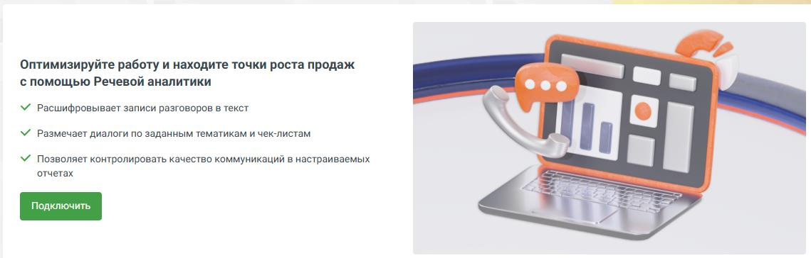
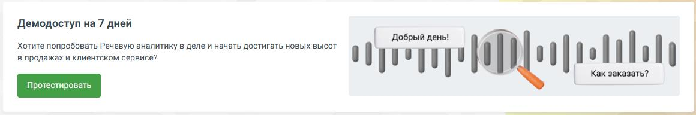
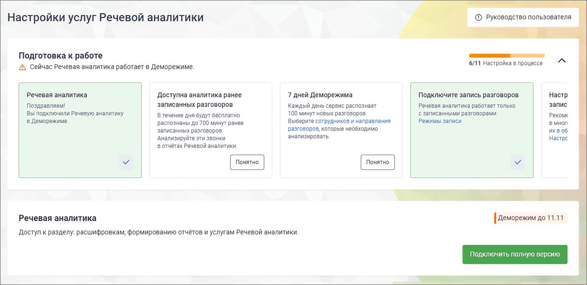

# 2.1. Подключение в демо-режиме

> Трассировка: PDF §2.1 · сквозные стр. 7-10 · источники: ч.1 `kb/mango-product-docs/sources/speech-analytics/RECHEVAYA-ANALITIKA_1.26.18.pdf` с.7-10.

Функционал демо-версии услуги Речевая аналитика полностью соответствует функционалу полной версии за исключением следующих ограничений: • длительность демо-периода составляет 7 дней с момента подключения; • суммарная длительность распознаваемых аудиозаписей ограничена 100 минутами аудиозаписи в сутки; • функциональность аналитики Текстовой коммуникации доступна для пяти сотрудников. Пользователь не может самостоятельно отключить демо-режим Речевой аналитики. Если пользователь не осуществит переход на платный тариф в течение 7 календарных дней, по истечении этого срока демоверсия деактивируется. Повторно подключить услугу в демо-режиме невозможно. Для подключения услуги Речевая аналитика в демо-режиме зайдите в Личный кабинет и найдите

на боковой навигационной панели иконку .

Перейдите в подраздел Речевая аналитика. Речевая аналитика | v.1.26.18 7

| 8 800 555 55 22, mango-office.ru |  |
| --- | --- |
|  | mango@mangotele.com |

Главная страница подраздела в краткой форме описывает возможности пользователя Речевой аналитики.

На экране ниже располагается кнопка подключения демо-версии Речевой аналитики.

После подключения на боковой навигационной панели ВАТС отобразится меню демо-версии Речевой аналитики. Количество оставшихся дней использования демоверсии отображается в плашке уведомления. На странице Настройки отображаются возможности Речевой аналитики в демо-режиме.

Речевая аналитика | v.1.26.18 8

| 8 800 555 55 22, mango-office.ru |  |
| --- | --- |
|  | mango@mangotele.com |

Из демо-режима вы можете в любой момент перейти к полной версии Речевой аналитики. Для перехода на полную версию щелкните по кнопке Подключить полную версию. Далее действуйте в соответствии с инструкцией. Для новых пользователей Речевой аналитики предусмотрен онбординг — пошаговое руководство по настройке и активации всех ключевых функций, необходимых для полноценной работы с сервисом. Карточки для онбординга расположены в верхней части страницы Настройки в блоке «Подготовка к работе». Онбординг помогает пользователю пройти все этапы настройки. Онбординг для демо-пользователей Речевой аналитики (9 шагов) • Речевая аналитика (демо) – после подключения демо-режима карточка помечена, как просмотренная. • Вам доступна аналитика ранее записанных разговоров (ретроспективных записей разговоров). • Вам доступны 7 дней Деморежима. В течение 7 дней сервис будет распознавать до 100 минут новых разговоров в день. • Подключите запись разговоров перейдя в настройки Записи разговоров по ссылке в тексте карточки. • Настройте параметры хранения записей перейдя в настройки многоканальной записи и облачного хранения по ссылке в тексте карточки. • Подключите ИИ Конспекты, в Деморежиме или полную версию. • Настройте Тематики. Перейдите на страницу «Тематики» по ссылке в карточке и произведите необходимые настройки. • Настройте Аналитику текстовых коммуникаций. В модальном окне выберите удобный тариф и сотрудников для аналитики. • Попробуйте ИИ Тегирование в Деморежиме: в течение 7 дней вы сможете бесплатно тегировать до 100 минут расшифрованных разговоров ежедневно. • Настройте ИИ Тегирование перейдя в настройки по ссылке в тексте карточки. Аналитика ретроспективных записей разговоров Если Речевая аналитика (в демо- или платном режиме) подключается впервые, пользователю доступна аналитика ретроспективных записей разговоров. Это аналитика по последним записям, сделанным до момента подключения услуги, но суммарной длительностью не более 700 минут. Данные ретро-записей предоставляются без оплаты, в обучающих целях. По распознанным разговорам можно производить поиск, по ключевым словам, а также поиск по тематикам в интерфейсе раздела «Запись разговоров». На основании распознавания и простановки на разговоры тематик можно просматривать отчеты. Попавшие в ретроспективу вызовы, на момент совершения которых была отключена запись разговора, учитываются только в отчетах речевой аналитики (поиск, по ключевым словам, и по тематикам в интерфейсе раздела «Запись разговоров» невозможен). Речевая аналитика | v.1.26.18 9

| 8 800 555 55 22, mango-office.ru |  |
| --- | --- |
|  | mango@mangotele.com |
