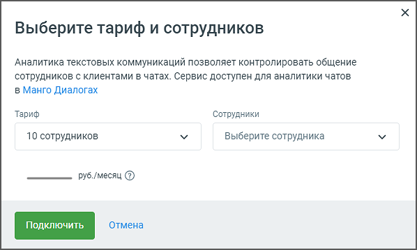

# 3.3. Аналитика текстовых коммуникаций

> Трассировка: PDF §3.3 · сквозные стр. 16-17 · источники: ч.1 `kb/mango-product-docs/sources/speech-analytics/RECHEVAYA-ANALITIKA_1.26.18.pdf` с.16-17.

коммуникаций Блок Аналитика текстовых коммуникаций позволяет настроить услугу аналитики текстовых коммуникаций, которая контролирует взаимодействие сотрудников с клиентами в чатах через сервис Манго Диалоги. По нажатию на кнопку Настройки открывается окно "Выберите тариф и сотрудников":

В данном разделе пользователю предлагаются следующие возможности: 1. Выбор тарифа: • Пользователь может выбрать один из доступных тарифных планов в выпадающем списке. Тариф определяется количеством сотрудников, чаты которых будут анализироваться (в примере на скриншоте выбран тариф на 10 сотрудников). 2. Выбор сотрудников: • В данном поле отображается количество сотрудников, выбранных для аналитики (в примере на скриншоте Выбрано 9 из 10 сотрудников). В выпадающем списке можно Речевая аналитика | v.1.26.18 16

| 8 800 555 55 22, mango-office.ru |  |
| --- | --- |
|  | mango@mangotele.com |

выбрать сотрудников, чаты которых будут контролироваться. Для выбора доступны только те сотрудники, кто уже выбран для распознавания разговоров. 3. Стоимость услуги: • В зависимости от выбранного тарифа автоматически рассчитывается ежемесячная стоимость услуги. После выбора тарифа и сотрудников необходимо нажать кнопку Применить, чтобы активировать или изменить услугу. Если пользователь передумал или не хочет вносить изменения, можно нажать кнопку Отмена, чтобы вернуться к предыдущему экрану без сохранения изменений. Эта настройка позволяет гибко управлять количеством сотрудников, чаты которых будут анализироваться, а также контролировать расходы на услугу в зависимости от выбранного тарифа.
