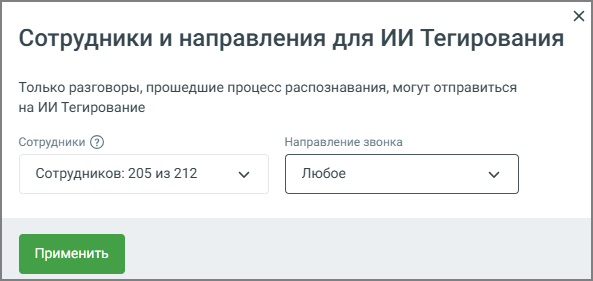

# 3.4.2. ИИ Тегирование

> Трассировка: PDF §3.4.2 · сквозные стр. 19-20 · источники: ч.1 `kb/mango-product-docs/sources/speech-analytics/RECHEVAYA-ANALITIKA_1.26.18.pdf` с.19-20.

Блок ИИ Тегирование позволяет настроить анализ разговоров сотрудников с использованием ИИ. Сервис анализирует разговоры не только по словам, но и по смыслу, что делает аналитику более точной и детализированной. ИИ Тегирование доступно для клиентов с подключённой услугой распознавания разговоров и включено по умолчанию. Анализ разговоров выполняется в рамках поминутной тарификации. Речевая аналитика | v.1.26.18 19

| 8 800 555 55 22, mango-office.ru |  |
| --- | --- |
|  | mango@mangotele.com |

1. Настройки сотрудников и направлений: По нажатию на кнопку Настройки пользователь может выбрать сотрудников, чьи разговоры отправляются на анализ через ИИ. Открывается дополнительное окно Сотрудники и направления для ИИ аналитики, где можно: • Выбрать сотрудников (в примере на скриншоте выбрано 200 сотрудников из 226 возможных). Для выбора доступны только те сотрудники, кто уже выбран для распознавания разговоров. • Указать направления звонков для анализа: любое, входящие, исходящие или внутренние звонки. 2. После настройки сотрудников и направлений нужно нажать кнопку Применить, чтобы сохранить изменения и запустить анализ для выбранных параметров. Эта настройка дает пользователю гибкость в управлении, позволяя выбирать конкретных сотрудников и направления звонков для более точного анализа с помощью ИИ.
