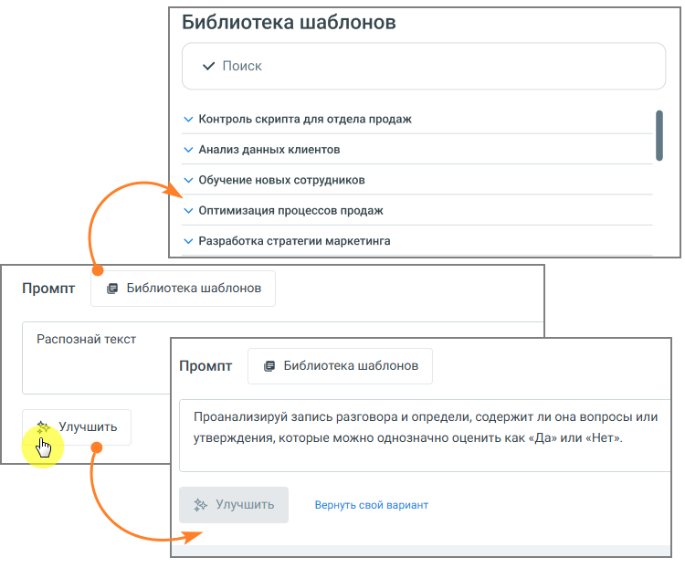
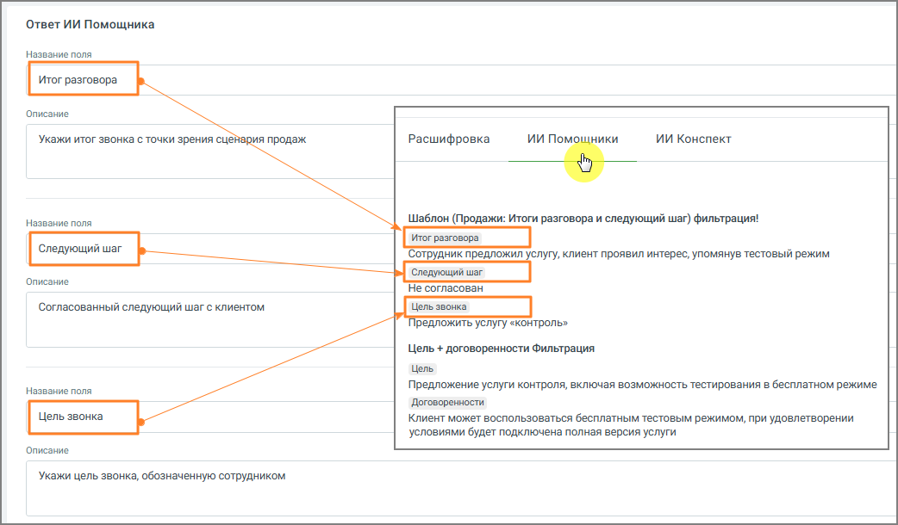
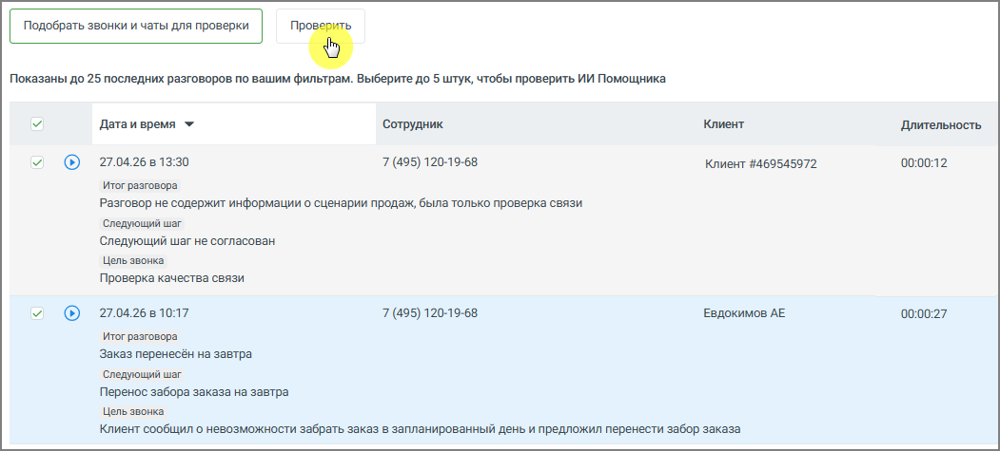

# 3.4.3.3. Настройка ИИ Помощника

> Трассировка: PDF §3.4.3.3 · сквозные стр. 22-25 · источники: ч.1 `kb/mango-product-docs/sources/speech-analytics/RECHEVAYA-ANALITIKA_1.26.18.pdf` с.22-25.

1. Название - введите название помощника. Рекомендуется указывать название по задаче, например: • Контроль скрипта • Анализ жалоб • Проверка качества общения 2. Промпт - определяет, какой именно результат будет получать пользователь. По сути, это описание задачи для анализа разговора. Чтобы результат был полезным: • формулируйте задачу конкретно • указывайте, что именно нужно определить или сформулировать • задавайте формат ответа (например, кратко, с примерами, с оценкой и т.д.) Один и тот же разговор может анализироваться по-разному в зависимости от промпта, поэтому рекомендуется создавать отдельные ИИ Помощники под разные задачи. • введите текст задания для анализа разговора • при необходимости нажмите Улучшить, чтобы система помогла уточнить формулировку • можно использовать Библиотеку шаблонов и выбрать нужный промт Речевая аналитика | v.1.26.18 22

| 8 800 555 55 22, mango-office.ru |  |
| --- | --- |
|  | mango@mangotele.com |

Примеры промта: • «Проанализируй диалог сотрудника с клиентом. Определи цель звонка, итог разговора, был ли согласован следующий шаг (какой именно) и на какую дату/время, а также наличие отказа и его причины словами клиента.» • «Ты оцениваешь диалог сотрудника контактного центра и клиента. В данном диалоге сотрудник пытался продать товар или услугу. Проанализируй диалог и дай свои рекомендации - что сотрудник мог бы улучшить в работе для повышения вероятности продажи. Отвечай емко и по существу. К каждой рекомендации делай отсылку к элементу диалога где обнаружена зона роста с указанием времени. Сделай максимум 5 ключевых рекомендаций не больше чем на 300 слов.» 3. Ответ ИИ Помощника - результат работы ИИ Помощника можно настроить под нужный уровень детализации. Возможны два подхода: • единый общий вывод по разговору • структурированный ответ, разбитый на несколько частей Разделение на части удобно, если требуется анализ по нескольким аспектам - например, в плеере отдельно выделить содержание разговора, принятые решения и последующие действия. На примере ниже показан вариант настроек структурированного ответа в блоке настроек, а также итоговое отображение ответа в плеере звонка. Речевая аналитика | v.1.26.18 23

| 8 800 555 55 22, mango-office.ru |  |
| --- | --- |
|  | mango@mangotele.com |

4. Звонки и чаты для анализа - здесь задаётся, какие разговоры будет анализировать помощник. Можно указать: • сотрудников или группы • номера • тип коммуникации (звонки, чаты) • направление звонков • длительность разговора Это позволяет применять помощника только к нужным диалогам. 5. Проверка работы ИИ Помощника Перед использованием рекомендуется проверить работу: 1. Выберите период и фильтры 2. Нажмите Подобрать звонки и чаты для проверки 3. Выберите до 5 разговоров 4. Нажмите Проверить Вы увидите, как помощник анализирует реальные диалоги. Речевая аналитика | v.1.26.18 24

| 8 800 555 55 22, mango-office.ru |  |
| --- | --- |
|  | mango@mangotele.com |

Тестирование позволяет заранее проверить, как ИИ Помощник будет анализировать реальные разговоры, до его сохранения и включения в работу. Это даёт пользователю следующие преимущества: • позволяет убедиться, что помощник правильно понимает задачу • помогает выявить неточности или ошибки в формулировке промпта • даёт возможность сравнить результат на нескольких разговорах • снижает риск получения некорректных или бесполезных выводов после запуска • экономит время, исключая необходимость последующей переработки настроек В результате пользователь получает более точный и предсказуемый анализ разговоров сразу после включения помощника. Для сохранения данных нажмите кнопку Создать. После этого помощник начнёт автоматически анализировать подходящие разговоры.
